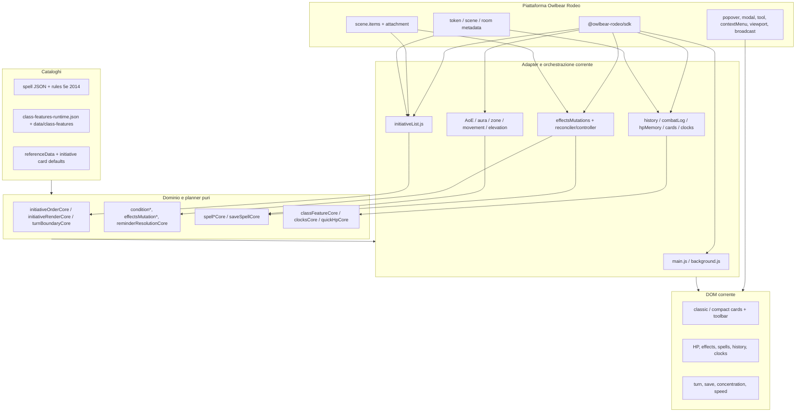
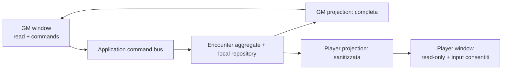

# Take Initiative — audit per il porting desktop

## Scopo e criteri

Questo audit fotografa il repository del plugin Owlbear Rodeo alla data del 5 agosto 2026 e prepara un futuro porting verso un combat tracker desktop locale per D&D 5e 2014, con una finestra GM autorevole e una finestra Player su un secondo monitor. Il desktop non avrà una mappa e non dipenderà da Owlbear Rodeo.

Non è una specifica d'implementazione e non propone di modificare il plugin. In particolare, non avvia Tauri, non sceglie un database e non prescrive una migrazione in-place. Le chiavi correnti `com.thebigpicture.initiative/meta` e `com.thebigpicture.initiative/state` restano il formato del plugin esistente.

Le classi usate nella matrice sono primarie ed esclusive:

- **KEEP**: logica pura o infrastruttura deterministica, importabile nel nuovo dominio con modifiche minime e senza SDK/DOM;
- **ADAPT**: comportamento utile, ma mescolato a SDK, DOM, storage browser o forme dati degli item OBR;
- **OBR-ONLY**: integrazione VTT, mappa, scene item, attachment, viewport, tool o popover OBR che non appartiene al prodotto desktop senza mappa;
- **CATALOG**: dati, regole e definizioni dichiarative riutilizzabili, da validare e versionare;
- **UI-REUSE**: rendering, stili e interazioni visive recuperabili; non significa riuso drop-in, perché molti componenti assumono DOM e popover OBR.

Conclusione sintetica: il repository contiene già un nucleo consistente da estrarre, soprattutto nei moduli `*Core.js`. Il rischio maggiore non è riscrivere le regole, ma trascinare nel nuovo core le forme `scene.items`, i metadata namespaced, i virtual ID codificati come stringhe e i side effect asincroni dell'SDK.

## 1. Mappa dell'architettura corrente

### 1.1 Entrypoint e runtime

Il build Vite è multi-page: 29 pagine HTML producono il tracker, il background persistente, menu contestuali, pannelli, tool e notice. I due entrypoint principali sono:

- `src/main.js`: crea il contenitore DOM del tracker e, su `OBR.onReady`, monta context menu, HP memory e `initiativeList`;
- `src/background.js`: monta il coordinatore delle mutazioni effetti, reconciler, aura/zone, reminder, prepared spell resolution, turn notice e tool VTT.

`src/initiativeList.js` è il centro operativo. Legge gli item CHARACTER della scena, proietta i metadata in entry di tracker, costruisce virtual entry Lair/Paragon/Epic, mantiene ordine/round/turno attivo, render classico/compatto, editor inline, HP, boss resource, quick action, focus/selection sulla mappa e notifiche di cambio turno. Il file contiene sia dominio sia adapter OBR sia view DOM; va scomposto per responsabilità, non portato come unità.

### 1.2 Fonti di verità correnti

| Scope corrente | Chiavi/storage | Responsabilità |
| --- | --- | --- |
| Token/item metadata | `com.thebigpicture.initiative/meta` | `hp`, `hpMax`, iniziativa, attitude, condizioni, concentrazione, boss, class feature state e profilo card |
| Token/item metadata | `com.thebigpicture.initiative/spells`, più campi storici sotto `meta` | istanze di spell e relativi contatori |
| Scene metadata | `com.thebigpicture.initiative/state` | ordine, indice corrente, round, Lair, gruppi, Paragon initiative e parte dello stato UI |
| Scene metadata | `.../history`, `.../clocks`, `.../combat-log-state` | undo/history, clocks e puntatore alla sessione log |
| Room metadata | `.../hpMemory`, `.../factionRegistry`, `.../initiativeCards`, `.../ui` | memoria cross-scene e sincronizzazione condivisa |
| Browser locale | `localStorage` | fallback HP/card/faction, layout/posizioni popover, impostazioni AoE e diagnostica |
| Browser locale | IndexedDB `com.thebigpicture.initiative.combat-log` | sessioni ed eventi del Combat Log |
| Scene attachment/item | metadata `activeTurnLabel`, HP bar, effect widget, aura/zone/AoE | output visuale derivato sulla mappa |

La separazione token/scene/room è una conseguenza della piattaforma, non un modello da replicare. Nel desktop la fonte di verità deve essere il repository locale dell'incontro; le due finestre devono ricevere proiezioni dello stesso stato applicativo.

### 1.3 Flussi critici

**Iniziativa.** `initiativeList.js` legge gli item, usa `initiativeOrderCore.js` per grouping, sorting, tie reorder, collapse e Paragon expansion, quindi riconcilia `state.order`. Lair (`__LAIR__`) ed Epic (`__EPIC__...`) sono virtuali; Paragon usa suffissi `::pN`. La navigazione ottimistica passa per code, revisioni, digest e stale guards prima di scrivere scene metadata e sincronizzare label/selection/notice.

**Turn boundary.** `turnBoundaryCore.js` genera chiavi stabili `round:index:actorId`. Il passaggio in avanti calcola boundary `end` e `start`, escludendo Lair/Epic e riconducendo Paragon al combatant base. Le boundary alimentano scadenza di condizioni, spell, reminder, reset di risorse leggendarie e Combat Log. Il percorso di round ticking e quello di turn ticking sono vicini ma distinti e vanno coperti entrambi dai test di parità.

**HP e History.** `meta.hp`/`meta.hpMax` sono canonici. `initiativeList.js` e `quick-hp-modal.js` applicano modifiche singole/batch; HP bar di tracker e mappa sono proiezioni. `hpMemory.js` ricorda PC/ally per nome base + ritratto su room/local storage. `history.js` osserva mutazioni, crea entry field-scoped, coordina undo e inoltra eventi a `combatLog.js`. Il Combat Log converte le entry in eventi leggibili e le salva in IndexedDB.

**Effetti.** Condizioni, spell e concentrazione vengono mutate attraverso una lane seriale nel background (`effectsMutationBroker` → `effectsMutationCoordinator` → `effectsMutations`). I planner puri calcolano before/after, precondizioni e undo atomico; controller e reconciler trasformano il risultato in metadata OBR e widget di scena.

**Boss e class feature.** Legendary, legendary resistance, Paragon ed Epic sono campi del metadata del token e virtualizzazioni dell'ordine. Le class feature usano un catalogo generato e un `classFeatureState` per risorse e istanze attive; `classFeatureCore.js` contiene gran parte della logica pura, mentre `classFeatureRuntime.js` orchestra scene item, distance, conditions, spells e History.

**Mappa.** AoE, zone statiche, aure, movimento, elevazione e distanza leggono bounds/position/grid DPI e creano path, label o attachment. I geometry core sono puri, ma i controller e le loro persistenze sono fuori scope per il desktop senza mappa.

## 2. Grafo delle dipendenze piattaforma/dominio



Il taglio desiderato per il desktop è tra `Pure + Catalogs` e gli adapter correnti. Il nuovo application layer deve dipendere da porte (`EncounterRepository`, `EventBus`, `Clock`, `IdGenerator`) e non da SDK, DOM o browser storage.

## 3. Inventario di `@owlbear-rodeo/sdk`

Sono presenti 72 file con import diretto dell'SDK. La tabella li enumera tutti; “destinazione” indica il trattamento nel desktop.

| File | Superfici SDK principali | Destinazione |
| --- | --- | --- |
| `action-launcher.js`, `background.js`, `main.js`, `sync-open.js` | bootstrap, action, room, broadcast | OBR-ONLY; sostituire con bootstrap e window bridge desktop |
| `initiativeList.js` | scene, room, player, viewport, popover, modal, action, broadcast, `buildLabel` | ADAPT; estrarre command/reducer/view-model, scartare side effect VTT |
| `classFeatureRuntime.js`, `conditionAutomation.js`, `conditions.js`, `effectsMutations.js`, `quickActionExecution.js`, `reminderResolution.js`, `spellApplicationExecutor.js`, `spells.js` | scene item read/update, player role, broadcast, label | ADAPT; mantenere planner e riscrivere repository/transaction adapter |
| `clocks.js`, `combatLog.js`, `factionRegistry.js`, `history.js`, `hpMemory.js`, `initiativeCards.js` | scene/room metadata, role, broadcast | ADAPT; sostituire con persistenza locale esplicita |
| `classFeatureReminderController.js`, `effectSaveReminderController.js`, `preparedSpellResolutionController.js` | scene metadata/item listeners, broadcast, popover | ADAPT; trasformare in subscriber dell'Encounter store |
| `concentration-warning.ts`, `effects-modal.ts`, `faction-configurator.ts`, `history-modal.ts`, `initiative-card-modal.js`, `prepared-spell-resolution.js`, `quick-hp-modal.js`, `spells-panel.js`, `turn-notice.ts` | onReady, role, popover, scene/room, broadcast | UI-REUSE; separare view model e comandi dal contenitore OBR |
| `clocks-modal.js`, `compactAdminMenu.js`, `initiative-card-context-menu.js`, `tracker-quick-actions.js` | broadcast, viewport, role/scene | UI-REUSE; riusare markup/interaction, sostituire il transport |
| `reference-modal.js`, `referencePopover.js` | action/modal/popover/broadcast | UI-REUSE; rendere pannello/finestra locale |
| `aoeSettings.js`, `aoeTargetTool.js` | interaction/tool/context menu/viewport/scene, `buildPath`, `buildText`, `Command` | OBR-ONLY; nessuna mappa nel desktop |
| `classFeatureAuraController.js`, `customAuraController.js`, `spellAuraController.js`, `spellStaticZone.js` | scene item/path/command, broadcast | OBR-ONLY; conservare solo core/cataloghi indipendenti |
| `custom-aura-modal.js`, `distance3d-modal.js`, `distance3dTool.js`, `distance3d.js`, `ctx-elevation.js`, `elevationLabel.js` | scene position/bounds, tool/popover, `buildLabel` | OBR-ONLY nel prodotto senza mappa |
| `contextMenu.js`, `ctx-add.ts`, `ctx-conditions.ts`, `ctx-mark.ts`, `ctx-remove-condition.ts` | context menu, selection, scene, theme, viewport | OBR-ONLY; le azioni utili diventano comandi GM normali |
| `clocksTool.js`, `referenceTool.js`, `speedMoveTool.js` | OBR tool/popover/viewport | OBR-ONLY; i contenuti clocks/reference restano riusabili |
| `effectsDiagnostics.js`, `effectsLayout.js`, `effectsLocalItemsProbe.js`, `effectsReconciler.js`, `spells-tag.js` | broadcast, local/scene item e label | OBR-ONLY; diagnostica e planner puri restano separati |
| `hpbar-items.js`, `sceneItemEvents.js` | attachment/item listeners, room/player | OBR-ONLY; le HP card desktop leggono direttamente il view model |
| `popoverDrag.js`, `popoverDragHost.js`, `trackerCompactResize.js`, `trackerPopover.js` | popover, viewport, broadcast | OBR-ONLY come host; riusare solo sizing/presentazione indipendente |
| `speedCheck.js`, `speed-warning.ts` | scene movement, viewport, modal/popover/broadcast | OBR-ONLY runtime; `speedCheckCore` rimane KEEP opzionale |
| `turnNoticeHost.js`, `zone-trigger-notice.ts` | broadcast, modal/popover, scene | OBR-ONLY host; la turn notice visuale è recuperabile, la zone notice no-map è fuori scope |
| `aoeSettings.js`, `clocks-modal.js`, `clocksTool.js`, `compactAdminMenu.js`, `concentration-warning.ts`, `effectsDiagnostics.js`, `history-modal.ts`, `initiative-card-context-menu.js`, `popoverDrag.js`, `reference-modal.js`, `tracker-quick-actions.js` | broadcast fra iframe/runtime | non copiare i channel; usare eventi tipizzati del desktop |

Nota: l'ultima riga è trasversale e ripete intenzionalmente i broadcaster per evidenziare un rischio; l'inventario dei file unici resta 72.

## 4. Matrice completa KEEP / ADAPT / OBR-ONLY / CATALOG / UI-REUSE

La matrice seguente assegna una classe primaria a tutti i 185 moduli JS/TS e agli 8 JSON in `src`. I core di geometria mappa classificati KEEP sono riusabili tecnicamente, ma non sono necessari all'MVP senza mappa.

| Classe | Moduli | Motivazione e azione |
| --- | --- | --- |
| KEEP | `src/aoeGeometryCore.js`, `src/classFeatureAuraCore.js`, `src/classFeatureAuraReminderCore.js`, `src/classFeatureCore.js`, `src/classFeatureReminderCore.js`, `src/clocksCore.js`, `src/combatLogCore.js`, `src/combatLogTurnCore.js`, `src/concentrationSaveReminderCore.js`, `src/conditionAutomationCore.js`, `src/conditionRulesCore.js`, `src/conditionSpeedCore.js`, `src/conditionTimingCore.js`, `src/customAuraCore.js`, `src/customAuraReminderCore.js`, `src/distance3dCore.js`, `src/effectLabelCore.js`, `src/effectSaveReminderCore.js`, `src/effectsDiagnosticsCore.js`, `src/effectsMutationBroker.js`, `src/effectsMutationCompositeHistoryCore.js`, `src/effectsMutationCoordinator.js`, `src/effectsMutationCore.js`, `src/effectsMutationUndoCore.js`, `src/effectsReconcilerCore.js`, `src/exhaustionCore.js`, `src/factionRegistryCore.js`, `src/hpConditionRulesCore.js`, `src/initiativeCardConflict.js`, `src/initiativeCardRegistryCore.js`, `src/initiativeDiagnosticsCore.js`, `src/initiativeOrderCore.js`, `src/initiativeRenderCore.js`, `src/initiativeRenderSchedulerCore.js`, `src/movementProfileCore.js`, `src/preparedSpellResolutionCore.js`, `src/quickActionConditionExecutionCore.js`, `src/quickActionsCore.js`, `src/quickActionSpellExecutionCore.js`, `src/quickHpCore.js`, `src/reminderResolutionCore.js`, `src/saveReminderNoticeCore.js`, `src/saveSpellCore.js`, `src/saveSpellOperationsCore.js`, `src/sceneEpochTimerCore.js`, `src/speedCheckCore.js`, `src/spellActiveActionCore.js`, `src/spellApplicationPlanCore.js`, `src/spellCastAutomationCore.js`, `src/spellCastContextCore.js`, `src/spellCastPhaseCore.js`, `src/spellEffectCore.js`, `src/spellExpiryCore.js`, `src/spellLifecycleOperationsCore.js`, `src/spellMechanicsCore.js`, `src/turnBoundaryCore.js`, `src/turnNotice.js` | Funzioni pure/planner deterministici. Copiare inizialmente con i test, poi rinominare solo nella nuova repo se serve. Geometry/aura core restano pacchetto opzionale finché non esiste una nozione desktop di area/target membership. |
| ADAPT | `src/buildInfo.js`, `src/classFeatureReminderController.js`, `src/classFeatureRuntime.js`, `src/clocks.js`, `src/combatLog.js`, `src/conditionApplicationExecutor.js`, `src/conditionAutomation.js`, `src/conditions.js`, `src/constants.js`, `src/effectSaveReminderController.js`, `src/effectsLayoutCore.js`, `src/effectsMutations.js`, `src/factionRegistry.js`, `src/history.js`, `src/hpConditionAutomation.js`, `src/hpMemory.js`, `src/initiativeCards.js`, `src/initiativeIncrementalRenderCore.js`, `src/initiativeList.js`, `src/metadataKeyScoped.js`, `src/preparedSpellResolutionController.js`, `src/quickActionExecution.js`, `src/reminderResolution.js`, `src/sceneEpoch.js`, `src/spellApplicationExecutor.js`, `src/spells.js` | Comportamento utile con SDK, storage browser, scene item shape o view invalidation. Estrarre funzioni e introdurre porte/repository; `sceneEpoch` diventa encounter generation/revision, non lifecycle OBR. |
| OBR-ONLY | `src/action-launcher.js`, `src/aoeSettings.js`, `src/aoeStyle.js`, `src/aoeTargetTool.js`, `src/background.js`, `src/classFeatureAuraController.js`, `src/clocksTool.js`, `src/contextMenu.js`, `src/ctx-add.ts`, `src/ctx-conditions.ts`, `src/ctx-elevation.js`, `src/ctx-mark.ts`, `src/ctx-remove-condition.ts`, `src/customAuraController.js`, `src/custom-aura-modal.js`, `src/distance3d.js`, `src/distance3d-modal.js`, `src/distance3dTool.js`, `src/effectsDiagnostics.js`, `src/effectsLayout.js`, `src/effectsLocalItemsProbe.js`, `src/effectsLocalItemsProbeCore.js`, `src/effectsReconciler.js`, `src/elevationLabel.js`, `src/hpbar-items.js`, `src/main.js`, `src/popoverDrag.js`, `src/popoverDragHost.js`, `src/quickHpAreaWorkflowCore.js`, `src/referenceTool.js`, `src/sceneItemBoundsCache.js`, `src/sceneItemChangeDispatcherCore.js`, `src/sceneItemEvents.js`, `src/sceneItemReconcileCore.js`, `src/speedCheck.js`, `src/speedMoveTool.js`, `src/spellAreaMembershipCore.js`, `src/spellAreaMutationQueue.js`, `src/spellAreaPlacementClient.js`, `src/spellAreaPlacementCore.js`, `src/spellAreaStyleCore.js`, `src/spellAuraController.js`, `src/spellAuraCore.js`, `src/spellAuraReminderCore.js`, `src/spells-tag.js`, `src/spellStaticZone.js`, `src/spellStaticZoneCore.js`, `src/spellStaticZoneReminderCore.js`, `src/spellZoneTriggerCore.js`, `src/staticSpellZoneRemovalCore.js`, `src/sync-open.js`, `src/trackerCompactResize.js`, `src/trackerPopover.js`, `src/turnNoticeHost.js`, `src/zone-trigger-notice.ts`, `src/zoneTriggerNoticeCore.js` | Host OBR, mappa, bounds/grid, attachments, selection/viewport, tool e reconciliation di scene item. Non entra nel core desktop. I planner puri di custom aura restano KEEP ma opzionali; se in futuro si introducono target group astratti, ripartire da quelli e non dai controller. |
| CATALOG | `src/areaSaveSpellRules.js`, `src/classFeatureCatalog.js`, `src/phb2014SpellRules.js`, `src/referenceData.js`, `src/spellAreaCatalog.js`, `src/spellAreaRules.js`, `src/spells-srd.js`, `src/supplementSpellRules.js`, `src/class-features-runtime.json`, `src/initiative-cards.json`, `src/spell-reference-it.json`, `src/spells-it-2014.json`, `src/spells-phb2014-extra.json`, `src/spells-srd-5.1.json`, `src/spells-supplements-2014.json`, `src/spells-supplements-runtime.json` | Copiare con provenance, versione schema e test di validazione. Le regole area sono catalogo opzionale nel desktop senza mappa; le regole spell/feature 5e 2014 sono centrali. |
| UI-REUSE | `src/clocks-modal.js`, `src/compactAdminMenu.js`, `src/compactEffectsPopover.js`, `src/concentration-warning.ts`, `src/counter.js`, `src/effects-modal.ts`, `src/faction-configurator.ts`, `src/history-modal.ts`, `src/initiativeCardBossClassic.js`, `src/initiativeCardClassic.js`, `src/initiativeCardClassicBuilder.js`, `src/initiativeCardCompact.js`, `src/initiative-card-context-menu.js`, `src/initiative-card-modal.js`, `src/initiativeEditors.js`, `src/initiativeMenuActionsCore.js`, `src/initiativeToolbar.js`, `src/menuPopoverProtocolCore.js`, `src/prepared-spell-resolution.js`, `src/quick-hp-modal.js`, `src/referenceButton.js`, `src/reference-modal.js`, `src/referencePopover.js`, `src/sceneEditorResetCore.js`, `src/speed-warning.ts`, `src/spellColorCore.js`, `src/spells-panel.js`, `src/spellsPanelAutomationViewCore.js`, `src/spellsPanelCasterSummaryView.js`, `src/spellsPanelCatalogMenu.js`, `src/spellsPanelFormWorkflow.js`, `src/spellsPanelOverviewView.js`, `src/spellsPanelTargetPicker.js`, `src/spellsPanelViewCore.js`, `src/trackerCompactSizingCore.js`, `src/trackerQuickActions.js`, `src/tracker-quick-actions.js`, `src/turn-notice.ts` | Recuperare colori, card, pips, form, reminder e view model. Sostituire inline style/OBR popover con componenti della UI desktop e testare GM/Player come proiezioni diverse. |

### 4.1 Asset, pagine, script e dati esterni a `src`

| Area | Classe | Trattamento |
| --- | --- | --- |
| `data/class-features/*.json` | CATALOG | Fonte e report di generazione; separare input canonici da audit/report e non spedire file di lavoro nel runtime desktop. |
| `scripts/generate-*.mjs`, `scripts/check-spell-catalog.mjs`, `scripts/audit-*.mjs` | KEEP/CATALOG tooling | Riutilizzare in un package `catalog-tools`, eliminando assunzioni sui path del plugin. |
| `scripts/build-metadata.mjs`, checksum/version scripts | ADAPT | Sono release tooling, non dominio; riscrivere per la nuova pipeline. |
| HTML di tracker, effects, spells, HP, history, clocks, reference, card e notice | UI-REUSE | Usare come reference visuale e di flusso, non come architettura multi-iframe. |
| `background.html`, context menu/tool HTML, AoE/distance/custom aura/zone pages | OBR-ONLY | Non portare nell'MVP desktop. |
| `public/*.css`, boss frame, condition/spell/history/clock/reference/initiative SVG | UI-REUSE | Copiare solo asset con licenza/provenance confermata; rimuovere variabili CSS `--obrt-*`. |
| asset AoE, elevation, zoom-on-token, map speed/distance | OBR-ONLY | Fuori scope senza mappa. |
| `test-support/initiativeSdkHarness.js`, `effectsSdkHarness.js`, `metadataKeyScopedHarness.js` | KEEP come harness di concorrenza | Rinominare le fake da “Sdk” a store/transport fake; conservare random latency, duplicate delivery, ordering e scene/encounter invalidation. |

## 5. Modello dati desktop proposto

Principi:

1. `ActorProfile` è riusabile fra incontri; `Combatant` è uno snapshot/istanza dell'incontro.
2. `EncounterState` contiene solo stato globale del combattimento e turn slot tipizzati, non ID virtuali codificati.
3. `EffectInstance` e `SpellInstance` hanno identità stabile e relazioni esplicite; concentrazione non è una mappa annidata opaca.
4. `HistoryEntry` serve all'undo transazionale; `CombatLogEvent` è un audit leggibile append-only. Non vanno fusi.
5. Stato canonico e stato UI sono separati. Collapse, tab aperto, dimensioni finestra e filtri non entrano nell'Encounter.
6. Tutte le entità portano `schemaVersion`; gli update usano revisioni ottimistiche o una singola command lane autorevole.

### `Campaign`

| Campo | Tipo/nota |
| --- | --- |
| `id`, `schemaVersion` | UUID e versione formato |
| `name`, `ruleset` | `ruleset = "dnd5e-2014"` |
| `locale`, `settings` | preferenze campagna, unità, visibilità Player |
| `activeEncounterId` | incontro presentato nelle due finestre |
| `createdAt`, `updatedAt` | timestamp |

Contiene o referenzia `ActorProfile[]` ed `Encounter[]`; non contiene lo stato volatile delle finestre.

### `Encounter`

| Campo | Tipo/nota |
| --- | --- |
| `id`, `campaignId`, `schemaVersion` | identità e ownership |
| `name`, `status` | `draft | active | paused | completed` |
| `combatantIds`, `clockIds` | aggregate membership |
| `state` | `EncounterState` corrente, oppure riferimento normalizzato |
| `createdAt`, `startedAt`, `endedAt`, `updatedAt` | lifecycle locale |
| `revision` | compare-and-swap/event ordering |

### `ActorProfile`

| Campo | Tipo/nota |
| --- | --- |
| `id`, `campaignId`, `schemaVersion` | identità persistente |
| `name`, `portraitUri`, `defaultAttitude` | sostituiscono matching fragile `name||portrait` |
| `hpMaxDefault`, `initiativeModifier`, `armorClass`, `passivePerception`, `speedMeters` | statistiche base |
| `spellSaveDC`, `spellAttackBonus`, `savingThrows` | scheda rapida |
| `notes`, `tags`, `quickActions` | configurazione tracker |
| `characterBuild`, `enabledClassFeatureIds`, `classFeaturesConfigured` | dati già presenti nelle initiative card |
| `sourceRef` | eventuale provenienza/import, mai un item OBR vivo |
| `createdAt`, `updatedAt` | lifecycle |

### `Combatant`

| Campo | Tipo/nota |
| --- | --- |
| `id`, `encounterId`, `actorProfileId?`, `schemaVersion` | istanza dell'incontro |
| `displayName`, `portraitUri`, `attitude` | override/snapshot per l'incontro |
| `hp`, `hpMax`, `temporaryHp` | HP canonici; `temporaryHp` solo se il dominio desktop lo introduce esplicitamente |
| `initiative`, `initiativeTouched`, `inInitiative` | stato di tracking |
| `boss` | `{ mode, legendaryActions, legendaryResistances, paragonActions, epic }` |
| `effectIds`, `spellInstanceIds`, `concentrationSpellInstanceId?` | relazioni esplicite |
| `classFeatureState`, `resources`, `exhaustion` | runtime di scheda/feature |
| `profileSnapshot` | campi necessari a rendere riproducibile l'incontro anche se il profilo cambia |
| `createdAt`, `updatedAt`, `revision` | concorrenza e audit |

### `EncounterState`

| Campo | Tipo/nota |
| --- | --- |
| `round`, `currentIndex` | round >= 1 e indice valido |
| `turnSlots` | array di `{ id, kind, combatantId?, sourceCombatantId?, afterCombatantId?, initiative }` |
| `lairEnabled` | genera slot `kind: "lair"` |
| `tieOrder` | ordine stabile a pari iniziativa, indipendente dalla UI |
| `activeTurnKey` | derivato o verificabile con `round/currentIndex/slot` |
| `phase` | `setup | running | completed` |
| `revision`, `lastCommandId` | ordering/idempotenza |

`kind` ammette almeno `combatant`, `lair`, `paragon`, `epic`. Così `__LAIR__`, `::pN` e `__EPIC__...` restano dettagli del formato legacy, non identità del nuovo dominio.

### `EffectInstance`

| Campo | Tipo/nota |
| --- | --- |
| `id`, `encounterId`, `targetCombatantId` | identità e bersaglio |
| `definitionId?`, `name`, `kind` | condition, spell-effect, class-feature, custom |
| `sourceCombatantId?`, `parentEffectId?`, `parentSpellInstanceId?` | provenienza |
| `startedAtTurnKey`, `duration`, `expiry` | `{ rounds?, mode, boundaryActorId? }` |
| `saveReminder`, `damageReminder`, `resolutionState` | reminder normalizzati |
| `flags`, `payload` | estensioni versionate e JSON-safe |
| `status`, `createdAt`, `updatedAt` | `active | expired | removed` |

Aura/zone non sono tipi spaziali nell'MVP. Un effetto applicato manualmente può conservare provenance “aura/zone” come testo o definition metadata, ma non deve attivare membership geometrica inesistente.

### `SpellInstance`

| Campo | Tipo/nota |
| --- | --- |
| `id`, `encounterId`, `spellDefinitionId`, `displayName` | identità runtime/catalogo |
| `casterCombatantId`, `targetCombatantIds` | relazioni |
| `phase`, `status`, `castAtTurnKey` | prepared/cast/active/resolved/expired |
| `slotLevel`, `choiceId`, `castContext` | parametri del lancio |
| `requiresConcentration`, `concentrationStatus` | una relazione esplicita col caster |
| `duration`, `expiryCounters`, `activeActions` | dati già pianificati dai core |
| `effectIds`, `resolutionIds` | effetti/reminder figli |
| `createdAt`, `updatedAt` | lifecycle |

### `Clock`

| Campo | Tipo/nota |
| --- | --- |
| `id`, `encounterId?`, `campaignId?` | clock d'incontro o campagna |
| `name`, `segments`, `filled`, `color`, `sortOrder` | equivalente normalizzato di `clocksCore` |
| `isVisibleToPlayers` | proiezione Player esplicita |
| `createdAt`, `updatedAt` | lifecycle |

### `HistoryEntry`

| Campo | Tipo/nota |
| --- | --- |
| `id`, `encounterId`, `schemaVersion`, `sequence` | ordine stabile |
| `commandId`, `correlationId`, `commandType` | idempotenza e tracing |
| `kind`, `label`, `createdAt`, `actor` | descrizione del comando |
| `targetIds`, `fields` | scope field-scoped |
| `changes` | `{ entityType, entityId, field, before, after }[]` con presenza esplicita |
| `sideEffects` | cambi correlati, anch'essi undoable/idempotenti |
| `undoState` | `available | applied | conflict | unavailable` |

### `CombatLogEvent`

| Campo | Tipo/nota |
| --- | --- |
| `id`, `encounterId`, `sequence`, `createdAt` | append-only |
| `round`, `turn` | snapshot `{ turnKey, slotId, combatantId?, name }` |
| `kind`, `action`, `label`, `source` | damage/healing/move/condition/spell/turn/note/undo/reminder |
| `targets` | snapshot di id/nome e dettagli rilevanti |
| `payload` | JSON versionato |
| `historyEntryId?`, `causationId?` | collegamento senza dipendenza inversa |

## 6. Funzioni da mantenere, trasformare e scartare

### Mantenere

- Iniziativa: `expandParagonEntries`, `sortByInitiative`, `sanitizeState`, `reorderWithinSameInitiativeState`, `reorderBlockWithinSameInitiativeState`, `advanceInitiativeState`, `initiativeStateDigest`, `initiativeTurnKeyAtOrdinal`, `currentInitiativeTurnKey`.
- Concorrenza/render: `createSerialProcessor`, `createInitiativeRenderScheduler`, revision/digest guard. Nel desktop proteggono comunque click rapidi e doppia finestra, anche se non esiste latenza OBR.
- Condizioni/effetti: normalizzazione, timing, expiry, exhaustion, automation plan, effects mutation plan e atomic undo dei moduli core.
- Spell: cast context/phase, application plan, lifecycle operations, save resolution, expiry, active action e mechanics core.
- Reminder: `planEffectSaveReminderNotices`, concentration warning, `buildReminderResolutionPlan`, damage/outcome controls e merge delle notice.
- Boss/class feature: planner di activation/deactivation/resource, progression, targeting non spaziale, resource refresh e catalog lookup.
- HP/History/Log: `calculateQuickHPChange`, zero-HP rules, composite History planner, `combatEventFromHistoryEntry`, aggregation e serialization.
- Clocks e profili: normalize/move clock, initiative card sanitizer/registry core, faction normalization.

### Trasformare

| Corrente | Desktop |
| --- | --- |
| `entryFromSceneItem` | `buildCombatantViewModel(combatant, profile, effects, spells, role)` |
| `readEntries`, `getSceneState`, `setSceneState`, `reconcileStateWithItems` | query/command su `EncounterRepository` e reducer di `EncounterState` |
| `queueNavigationState` e metadata queue | `AdvanceTurnCommand` in una command lane, con revision e idempotency key |
| `updateHP`, `updateMultipleHP`, group HP seed | `ApplyHpChangeCommand`/`ApplyHpBatchCommand` atomici |
| `conditions.js`, `spells.js` writer | repository services che applicano i planner puri |
| `effectsMutations.js` | Unit of Work locale: prevalidate → commit aggregate → History → Combat Log |
| `history.js` watchers | History prodotta dai comandi, non inferita osservando il database dopo il fatto |
| `combatLog.js` | repository append-only separato dallo storage scelto |
| `hpMemory.js`, initiative card/faction room registry | `ActorProfile` stabile; matching legacy solo nell'importer |
| role checks `IS_GM` nel DOM | due proiezioni: `GmEncounterViewModel` e `PlayerEncounterViewModel` |
| broadcast channel e popover payload | eventi/IPC tipizzati tra finestre e store centrale |
| `sceneEpoch` | `encounterId + encounterRevision + AbortSignal` per invalidare lavoro stantio |
| virtual ID parser | `TurnSlot.kind` e relazioni tipizzate |
| `renderAll` e incremental item planner | store subscription + keyed component rendering; preservare editor dirty/stale guard |

### Scartare dall'MVP desktop

- creazione/sync delle map HP bar e HP text attachment;
- active-turn label sulla mappa, selection, autofocus, viewport center/zoom e nudge token;
- context menu OBR e tool dock;
- costruzione/reconcile di AoE path, zone statiche e aura spaziali;
- movement watcher da coordinate, speed boundary da drag, elevazione e distanza 3D fra token;
- scene item bounds cache, derived-item filters, local-item probes e attachment layout;
- room/scene metadata writer, channel names, `OBR.onReady`, role API e popover positioning;
- sincronizzazione open/close del tracker dentro Owlbear.

Non scartare i concetti di target, durata, reminder o concentrazione solo perché oggi sono attivati da zone/aure: mantenerli come comandi manuali o rule-driven non spaziali.

## 7. GM e Player nel desktop

Oggi entrambe le viste derivano dallo stesso DOM e `IS_GM` nasconde controlli. Il Player non riceve toolbar amministrativa, editing, history, quick feature actions e class feature context; continua a vedere ordine, turno, portrait, effetti e HP secondo attitude/visibility. L'apertura del tracker è sincronizzata via room metadata e broadcast.

Nel desktop è preferibile un solo processo/store autorevole e due finestre:



La sicurezza/riservatezza non deve basarsi su `display:none`: il Player view model non deve contenere note GM, HP nascosti, CD/bonus nascosti, feature non pubbliche o azioni amministrative. Eventuali risoluzioni affidate al Player devono produrre un input tipizzato validato dall'application layer; il GM resta autorevole.

## 8. Ordine consigliato di estrazione

1. **Congelare i contratti legacy.** Salvare fixture anonime di token metadata, scene state, History e log; documentare virtual ID e regole di visibilità.
2. **Creare il package domain isolato.** Copiare solo KEEP e relativi test senza `@owlbear-rodeo/sdk`, DOM, `window`, storage o chiavi metadata.
3. **Estrarre cataloghi 5e 2014.** Separare sorgenti, runtime generated JSON, validator e provenance; mantenere gli script di audit/generazione.
4. **Introdurre i modelli desktop e gli adapter legacy in memoria.** Convertire fixture OBR in `Campaign/Encounter/ActorProfile/Combatant/...`; nessun database ancora.
5. **Portare initiative reducer e turn boundary.** TurnSlot tipizzati, Lair/Paragon/Epic, tie order, forward/backward round e stale navigation.
6. **Portare HP, History e Combat Log.** Un solo command pipeline e undo field-scoped prima di aggiungere automazioni.
7. **Portare conditions, spells, concentration e reminder.** Effects mutation planner come transazione locale; prepared/active spell e boundary expiry.
8. **Portare boss, clocks e class feature.** Prima planner/resource, poi le UI di configurazione.
9. **Costruire le proiezioni GM/Player.** Testare redazione dei dati prima dei componenti visuali.
10. **Recuperare la UI.** Card classic/compact, toolbar, HP/effects/spells/history/clocks e notice; sostituire iframe/popover con componenti condivisi.
11. **Valutare solo dopo l'MVP le logiche spaziali.** Geometry, aura, zone, movimento/quota/distanza restano package opzionale o vengono omesse definitivamente.

## 9. Test di parità necessari

Il repository contiene 135 test Node. Sono un buon patrimonio, ma molti contract test verificano la forma del plugin più che il dominio desktop.

### Suite da trasferire quasi invariata

- `initiativeOrderCore`, `initiativeRenderCore`, `turnBoundaryCore`, `turnNotice`;
- conditions rules/timing/automation/exhaustion;
- effects mutation plan/coordinator/undo/composite History;
- quick HP e zero-HP reconciliation;
- clocks, Combat Log core, reminder resolution;
- spell cast/application/lifecycle/save/expiry/active action;
- class feature catalog/core e le suite Barbarian, Bard, Cleric, Paladin, Ranger, Rogue, Sorcerer;
- catalog integrity per PHB 2014, supplementi e traduzioni.

### Nuove parity fixture end-to-end

1. **Iniziativa base:** sort discendente, tie stability, reorder solo a pari iniziativa, add/remove actor e mantenimento dell'attivo.
2. **Boundary:** next/previous con wrap round, salti multipli, nessun tick retrogrado, boundary start/end e turn key stabile.
3. **Virtual turn:** Lair a 20, Epic dopo ogni PC, Paragon N slot con ritorno al combatant base; nessun lookup di entità usando un virtual ID.
4. **Click rapidi:** 50 next/previous con consegne duplicate/fuori ordine; stato finale, Player projection e log devono convergere.
5. **HP:** absolute/relative, clamp, batch, group delta/max, 0 HP conditions, damage che attiva concentrazione/reminder, undo atomico.
6. **History:** before/after field-scoped, campi estranei preservati, conflict su stato divergente, retry/idempotenza, max/history policy decisa esplicitamente.
7. **Combat Log:** conversione HP/condition/spell/turn/reminder/undo, sequence stabile, export text/JSON e collegamento a History.
8. **Conditions:** istanze omonime, parent effect, start/end expiry, round expiry, rimozione selettiva, exhaustion e speed modifiers.
9. **Spells/concentration:** cast immediate/prepared, target, save outcome, slot/choice, concentrazione singola, break/replace, expiry e active action.
10. **Reminder:** merge concorrente, clear sul nuovo turno, resolution passed/failed/immune, danno richiesto, permessi GM/Player e deduplica event ID.
11. **Boss:** legendary reset al turno corretto, resistance counters, Paragon initiative override, Epic slot injection e Lair interaction.
12. **Class feature:** activation/deactivation, resource cost/refresh, parent/child effect, concentration break, target/range non spaziale e temporary HP.
13. **Clocks:** normalize, segment bounds, reorder, visibility Player e persistence round-trip.
14. **GM/Player:** snapshot delle due proiezioni; il Player non deve ricevere note/controlli/campi riservati, non soltanto non renderizzarli.
15. **Persistence:** close/reopen, crash fra state commit/History/log, schema migration, backup/export/import e active encounter switching.

### Harness da riusare

- `InitiativeSdkHarness`: mantenere random latency, duplicate metadata delivery, serial processor e stale-render assertions; sostituire l'SDK fake con command bus/store fake.
- `EffectsSdkHarness`: mantenere multi-client, revision, reconcile queue, deduplica e notification disorder; rimuovere widget/scene item dal modello finale.
- `DeterministicMetadataHarness`: mantenere controlled commit order e shallow-conflict scenarios, ma puntare a transazioni aggregate del repository.
- Contract test che leggono sorgenti e cercano import/canali OBR: non sono parity test; vanno sostituiti con boundary/lint test della nuova repo.

AoE, zone, aura, movement, elevation e distance test non bloccano l'MVP desktop. Possono restare nel plugin e, se si conserva un package geometry opzionale, solo i test puri (`aoeGeometryCore`, `distance3dCore`, parte di `speedCheckCore`) vanno trasferiti.

## 10. Rischi di dipendenze OBR accidentali

1. **Import transitivi.** `classFeatureRuntime`, `conditions`, `spells`, `initiativeCards` e anche nomi apparentemente innocui senza suffisso adapter importano l'SDK. Copiare un planner insieme al suo barrel può reintrodurre OBR.
2. **Dynamic import.** `initiativeList.js` carica `classFeatureRuntime.js` dinamicamente; una ricerca limitata agli import statici non basta.
3. **Costanti contaminate.** `constants.js` non importa l'SDK, ma espone namespace e broadcast channel OBR. Nel domain desktop non deve esistere `com.thebigpicture.initiative/*`.
4. **Shape leak.** Controlli su `item.layer`, `attachedTo`, `image.url`, `position`, `metadata[META_KEY]` e builder `buildLabel/buildPath/buildShape` sono dipendenze di piattaforma anche senza import SDK diretto.
5. **Global browser.** `document`, `window`, `localStorage`, `indexedDB`, `crypto`, timer e `URL` possono rendere un modulo non eseguibile nel core/test runtime.
6. **Side effect all'import.** Alcuni moduli registrano listener o avviano mount a livello modulo; importarli per una singola funzione può montare runtime OBR.
7. **Virtual ID come entity ID.** Split su `::p`, `__LAIR__` e `__EPIC__` porta logica legacy in repository e foreign key.
8. **Semantica metadata.** `setMetadata` fa merge shallow; i writer correnti proteggono chiavi possedute. Un database transazionale ha semantica diversa e non deve emulare accidentalmente race e tombstone OBR.
9. **UI role leak.** Un componente che riceve il modello GM e nasconde campi via `IS_GM` può esporre dati nella finestra Player.
10. **Cataloghi con path runtime.** `spells-srd.js` importa più JSON e rules; un barrel catalogo può trascinare regole area non necessarie o asset URL del plugin.

Guardrail raccomandati nella nuova repo:

- non aggiungere `@owlbear-rodeo/sdk` al `package.json`;
- regola lint `no-restricted-imports` per SDK e per qualunque path `legacy-obr` dai package `domain`, `application` e `catalogs`;
- test di architettura che fallisce su `OBR`, `com.thebigpicture.initiative`, `scene.items`, `attachedTo`, `buildLabel|buildPath|buildShape|Command` nel core;
- package boundaries unidirezionali: `platform-desktop → application → domain`, mai il contrario;
- adapter `legacy-obr-import` separato, opzionale e non dipendenza del runtime;
- nessun DOM/storage access nel domain; clock, UUID e persistenza iniettati;
- view model Player costruito server-side/application-side rispetto alla finestra, con test di redazione.

## 11. Struttura proposta per `take-initiative-desktop`

La struttura evita di scegliere oggi Tauri o il database. `apps/desktop` potrà in seguito contenere il framework scelto senza contaminare il dominio.

```text
take-initiative-desktop/
├─ apps/
│  └─ desktop/
│     ├─ src/bootstrap/          # lifecycle app e creazione finestre
│     ├─ src/windows/gm/         # composizione finestra GM
│     ├─ src/windows/player/     # composizione finestra Player
│     └─ src/platform/           # IPC/window adapter, nessun dominio
├─ packages/
│  ├─ domain/
│  │  ├─ src/models/             # dieci entità dell'audit
│  │  ├─ src/initiative/
│  │  ├─ src/effects/
│  │  ├─ src/spells/
│  │  ├─ src/features/
│  │  ├─ src/reminders/
│  │  ├─ src/history/
│  │  └─ test/
│  ├─ application/
│  │  ├─ src/commands/
│  │  ├─ src/queries/
│  │  ├─ src/services/
│  │  ├─ src/projections/gm/
│  │  ├─ src/projections/player/
│  │  └─ src/ports/              # repository, event bus, clock, ID
│  ├─ catalogs-5e2014/
│  │  ├─ src/spells/
│  │  ├─ src/class-features/
│  │  ├─ src/reference/
│  │  ├─ schemas/
│  │  └─ test/
│  ├─ catalog-tools/             # generate/check/audit scripts
│  ├─ persistence/
│  │  ├─ src/repositories/       # implementa le porte; backend da scegliere
│  │  ├─ src/migrations/
│  │  └─ test/
│  ├─ ui/
│  │  ├─ src/components/
│  │  ├─ src/combat-tracker/
│  │  ├─ src/panels/
│  │  ├─ src/notices/
│  │  ├─ src/theme/
│  │  └─ test/
│  └─ legacy-obr-import/
│     ├─ src/readers/             # legge export/fixture, mai OBR live
│     ├─ src/mappers/
│     └─ test/fixtures/
├─ tests/
│  ├─ parity/
│  ├─ concurrency/
│  ├─ gm-player-projections/
│  └─ persistence/
├─ docs/
│  ├─ architecture/
│  ├─ data-model/
│  └─ parity/
└─ package.json
```

Dipendenze consentite:

```text
apps/desktop ──> ui ──> application ──> domain
       │                    │              ▲
       └────> persistence ──┘              │
catalog-tools ──> catalogs-5e2014 ─────────┘
legacy-obr-import ──> application + domain
```

`legacy-obr-import` deve essere una foglia: può conoscere metadata legacy, ma nessun package runtime deve dipendere da esso.

## 12. Decisioni da prendere prima dell'implementazione

- policy esatta di visibilità HP/effects nella finestra Player;
- se il Player può risolvere reminder o è completamente read-only;
- durata/retention di History e Combat Log e garanzie crash-consistency;
- semantica di modifica di un `ActorProfile` durante un encounter attivo;
- gestione di temporary HP, attualmente non parte dei campi HP canonici del plugin;
- quali supplementi 2014 distribuire e relativa provenienza/licenza;
- se clocks sono di campagna, incontro o entrambi;
- se geometry/movement rimangono esclusi definitivamente o come package opzionale non visuale.

La prima milestone consigliata non è una finestra desktop: è un package domain che esegue le fixture di parità di iniziativa, boundary, HP, effetti e History senza poter importare l'SDK.
