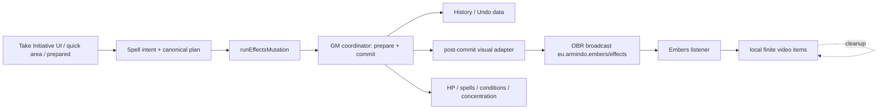
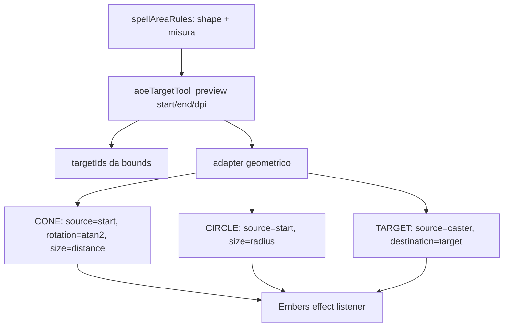

# Audit tecnico: integrazione Embers nel workflow spell

Data dell'audit: **2026-08-07** (Europe/Rome)

Esito: **GO WITH LIMITATIONS** per una integrazione opzionale, post-commit e limitata agli effetti one-shot. **Non è GO** per una integrazione completa del catalogo, degli effetti persistenti o delle azioni Embers senza un contratto pubblico versionato e chiarimenti del maintainer.

## 1. Perimetro e baseline riproducibile

Sono stati esaminati due repository distinti:

| Repository | Percorso locale | Remote | Revisione analizzata |
|---|---|---|---|
| Take Initiative | `C:\Progetti\obr-initiative` | `https://github.com/mrfireshift/take-initiative` | branch `main`, commit `dfb5e83724a7af6c83a23ce1029b97312577bf8c`, `2026-08-05T12:27:46+02:00` |
| Embers | `C:\Progetti\embers` | `https://github.com/ArmindoFlores/embers` | branch `main`, commit `842d674946a4e031013ce12d0a5502b0e78bd407`, `2026-05-13T16:24:53+02:00` |

Embers è stato clonato separatamente in `C:\Progetti\embers`; non è stato aggiunto come submodule, dipendenza o cartella interna e non è stato modificato. Il worktree di Take Initiative era già dirty prima dell'audit; le modifiche preesistenti sono state preservate.

Non sono stati modificati file di produzione, manifest, dipendenze, branch, commit o remote. I due documenti di questo audit sono gli unici artefatti prodotti dal lavoro corrente.

Riferimenti upstream: [Take Initiative](https://github.com/mrfireshift/take-initiative/tree/dfb5e83724a7af6c83a23ce1029b97312577bf8c), [Embers](https://github.com/ArmindoFlores/embers/tree/842d674946a4e031013ce12d0a5502b0e78bd407).

## 2. Verdetto operativo

La strategia raccomandata è un **adapter minimale di broadcasting**:

1. Take Initiative continua a possedere caster, bersagli, geometria, outcome, HP, condizioni, spell, concentrazione, History, Undo e Combat Log.
2. Take Initiative costruisce un payload Embers esplicito e limitato, senza copiare runtime, asset, `effect_record.json`, `spells_record.json` o blueprint.
3. Il payload viene inviato solo dopo il commit canonico riuscito (`status: applied`); un fallimento del renderer non deve annullare né ritardare il commit.
4. Embers riceve soltanto istruzioni `effect` one-shot: niente UI di selezione, niente caster picker, niente target selection, niente `action`, `interactions`, `attachedTo` o durata persistente nel MVP.
5. L'integrazione è opt-in, best effort e degradabile: se Embers non è installato o non risponde, Take Initiative resta funzionale.

Il rischio principale non è il broadcast in sé, ma l'assenza di un contratto API pubblicato e versionato. Il README di Embers dichiara che il broadcasting espone molte capacità, ma anche che la documentazione API non è ancora pubblicata; il repository mostra inoltre issue aperte su playback, geometria e controllo degli effetti. [README Embers](https://github.com/ArmindoFlores/embers/blob/842d674946a4e031013ce12d0a5502b0e78bd407/README.md), [issue list](https://github.com/ArmindoFlores/embers/issues).

## 3. Contratto broadcast osservato in Embers

### 3.1 Canali

Nel codice attuale il canale renderer è:

```text
eu.armindo.embers/effects
```

È definito in `src/effects/messageListener.ts` come `MESSAGE_CHANNEL`. Il listener registra esclusivamente `OBR.broadcast.onMessage(MESSAGE_CHANNEL, ...)`.

`eu.armindo.embers/blueprints` è esportato come `BLUEPRINTS_CHANNEL`, ma nella revisione analizzata non risultano listener o sender che lo usino: non va trattato come API disponibile.

Gli altri canali (`.../setup`, `.../settings`) servono alla sincronizzazione interna di Embers e non sono un contratto di integrazione per un'applicazione esterna.

### 3.2 Envelope accettato

La forma effettivamente letta dal listener è:

```js
{
  instructions: EffectInstruction[],
  interactions?: { count: number, ids: string[] },
  spellData?: { name: string, caster: string }
}
```

Il listener fa un cast TypeScript/JavaScript, non una validazione runtime completa dell'envelope e non invia ACK, errore o completion event al mittente.

Campi di `EffectInstruction` osservati:

| Campo | Semantica osservata |
|---|---|
| `id` | ID interno dell'effetto o dell'azione; deve essere stringa. |
| `type` | `"effect"` oppure `"action"`; è necessario per il percorso renderer. |
| `delay` | millisecondi relativi alla ricezione dell'istruzione. |
| `effectProperties` | Proprietà geometriche dipendenti dal tipo catalogato. |
| `duration` | millisecondi; sovrascrive la durata catalogo quando valorizzato. |
| `loops` | numero di ripetizioni; `-1` entra nella semantica persistente. |
| `for` | filtro locale `"GM"` o `"CASTER"`; assenza significa tutti i client che ricevono il broadcast. |
| `metadata` | metadata passati alla image OBR; non è un archivio canonico Take Initiative. |
| `layer`, `zIndex`, `forceVariant` | override di rendering. |
| `instructions` | figli eseguiti dopo l'effetto padre. |
| `arguments` | argomenti per le action. |

Le forme geometriche necessarie al MVP sono:

```js
// TARGET o WALL
{
  copies: 1,
  source: { x: number, y: number },
  destination: { x: number, y: number },
  sourceId?: string,
  destinationId?: string
}

// CONE
{
  source: { x: number, y: number },
  rotation: number, // gradi, atan2(y, x)
  size: number      // distanza in coordinate scena, non celle logiche
}

// CIRCLE
{
  source: { x: number, y: number },
  size: number,     // raggio in coordinate scena
  rotation?: number
}
```

Il listener legge `OBR.scene.grid.getDpi()` e usa il rapporto fra coordinate scena e DPI per scegliere la variante video. Per questo Take Initiative deve convertire le proprie misure in coordinate scena prima del broadcast; non deve inviare metri o numero di celle come `size`.

### 3.3 Semantica di consegna e lifecycle

- I sender interni di Embers usano `{ destination: "ALL" }`; il listener viene quindi eseguito localmente su ogni client.
- Gli effetti finiti vengono aggiunti a `scene.local`, attendono la durata e vengono eliminati localmente.
- Un effetto con durata negativa può diventare un item condiviso in `scene.items`, in base alle impostazioni e al ruolo/caster.
- Non esiste deduplica per `eventId`, protocol version, capability discovery, readiness event o ACK.
- Il listener esegue le istruzioni top-level in parallelo con `Promise.allSettled`; anche i figli vengono avviati in parallelo dopo il completamento del padre. Non va usato per una transazione o per garantire ordine globale.
- `for: "GM"` e `for: "CASTER"` sono filtri locali, non autorizzazioni. Il broadcast non impedisce a un altro client di inviare un payload.

### 3.4 Incoerenze già presenti in Embers

L'implementazione interna non è una specifica stabile:

- `effects.ts:doEffect()` invia istruzioni senza `type`, benché `messageListener.ts` richieda il ramo `type === "effect"`.
- Lo stesso helper circle usa `position`, mentre il listener legge `source`.
- Lo stesso helper cone invia `source` e `destination`, mentre il listener richiede `source`, `rotation` e `size`.
- L'interfaccia dichiara `copies` obbligatorio, ma il listener applica un default mutando l'oggetto quando manca.
- `BLUEPRINTS_CHANNEL` è dichiarato ma non costituisce un percorso osservabile.

L'adapter deve quindi emettere esclusivamente il sottoinsieme che il listener consuma oggi, includendo sempre `type: "effect"` e le proprietà geometriche corrette. Non deve imitare i payload generati dal vecchio helper UI.

## 4. Embers: renderer, catalogo, asset e autorizzazioni

### 4.1 Renderer e dati che non devono essere copiati

I punti esaminati sono:

- `src/effects/messageListener.ts`: ingresso broadcast e dispatch.
- `src/effects/effects.ts`: catalogo, scelta variante, URL asset, image metadata e registrazione local/shared.
- `src/effects/projectile.ts`, `src/effects/cone.ts`, `src/effects/aoe.ts`: trasformazione da geometria a image OBR.
- `src/effects/blueprint.ts`, `src/effects/spells.ts`: risoluzione delle spell Embers.
- `src/effects/actions.ts`: azioni come movimento, interazioni e messaggi arbitrari.
- `src/components/Settings/settings.ts`, `src/background.ts`: settings, ruoli e sincronizzazione lista locale.
- `src/assets/effect_record.json`, `src/assets/spells_record.json`: cataloghi di dati.

Il runtime Embers importa localmente `effect_record.json`; `getEffect(id)` richiede un path dotted nel suo catalogo. L'URL video viene costruito da `ASSET_LOCATION`, basename e variante, con default dipendente dall'origine dell'estensione. Gli asset video non sono un set autonomo da incorporare in Take Initiative.

`prefetchAssets()` e `precomputeProjectileAssets()` esistono nel codice, ma non è emerso un percorso broadcast pubblico per invocarli. Take Initiative non deve tentare di ricostruire URL asset o scaricare la Library privata di Embers.

### 4.2 Primo playback e cache

L'issue aperta [#47 “Spell effects sometimes won't play”](https://github.com/ArmindoFlores/embers/issues/47) descrive effetti che, soprattutto al primo cast e per durate brevi, non appaiono o scompaiono quasi subito. È direttamente pertinente a Fire Bolt e ad altri projectile brevi. Il MVP deve quindi:

- trattare il primo playback come rischio noto, non come errore della transazione;
- misurare la latenza di first-use in test manuali;
- non introdurre retry automatici, perché senza deduplica un retry può duplicare l'animazione;
- chiedere al maintainer una API di readiness/prefetch o un evento di asset warm-up prima di dichiarare affidabile la copertura.

La lista issue pubblica mostrava inoltre, al momento dell'audit, [#81 “Radius doesn't work properly for custom Grid Size”](https://github.com/ArmindoFlores/embers/issues/81), pertinente alla conversione `size`/DPI, e [#83 “GM lacks control over player Active Effects”](https://github.com/ArmindoFlores/embers/issues/83), pertinente a ownership e persistenti. [#80](https://github.com/ArmindoFlores/embers/issues/80) riguarda invece il roll automatico durante il cast ed è secondario per il renderer one-shot. Questi titoli non vengono trattati come bug riprodotti localmente: sono segnali di rischio da verificare con test e maintainer.

### 4.3 Licenze

Embers non contiene un file root `LICENSE`/`COPYING` nella revisione analizzata e `package.json` non dichiara un campo `license`. Il README dichiara che gli asset JB2A sono CC BY-NC-SA e collega il testo Creative Commons. Questo chiarisce l'attribuzione dichiarata per gli asset, ma non concede automaticamente il riuso del codice, dei JSON di catalogo o dei blueprint di Embers.

Take Initiative ha una propria licenza ISC e propri dati/notice. L'integrazione proposta non copia asset, codice, JSON o blueprint Embers; invia solo identificatori di interoperabilità e coordinate. Prima di distribuire una mappa ampia di ID o qualsiasi asset deve essere ottenuta conferma scritta su:

- licenza del codice e dei cataloghi Embers;
- permesso di usare gli ID del catalogo in un adapter esterno;
- attribuzione richiesta nel manifest/UI di Take Initiative;
- limiti non-commerciali e obblighi share-alike degli asset JB2A;
- stabilità e hosting degli asset richiesti via `ASSET_LOCATION`.

## 5. Architettura canonica di Take Initiative

### 5.1 Source of truth

I campi canonici restano invariati:

- token metadata: `com.thebigpicture.initiative/meta`;
- scene tracker state: `com.thebigpicture.initiative/state`;
- spell instances e concentrazione dentro il metadata canonico del token;
- HP: `meta.hp` e `meta.hpMax`.

Embers deve essere un sink visuale. I suoi video local/shared e i metadata `eu.armindo.embers/*` non possono diventare source of truth per spell, HP, concentrazione o History.

### 5.2 Funneling del commit

Il funnel principale è `src/spellApplicationExecutor.js`:

```text
buildSpellApplicationIntent()
  -> buildSpellApplicationPlan()
  -> runEffectsMutation(applicationPlan.operations)
  -> requireAppliedEffectsMutation(mutation)
  -> refreshConditionLabels()
```

`runEffectsMutation()` trasporta il comando al servizio coordinator GM quando il chiamante è un client; il coordinator prepara e committa con le guardie di scene epoch/identity, registra History dopo il commit e restituisce `status: "applied"`, `changedIds`, `changes` e dati del comando.

Il punto minimo e sicuro per un evento visuale è subito dopo `requireAppliedEffectsMutation(mutation)`. A quel punto il commit canonico è riuscito; un errore di broadcast non deve propagarsi come errore di spell.

### 5.3 Percorsi di lancio e risoluzione censiti

| Percorso | Entry/function | Commit canonico | Hook Embers |
|---|---|---|---|
| Cast dal pannello | submit di `wireSpellPanelFormWorkflow()` in `src/spellsPanelFormWorkflow.js`, callback `commitSpellApplication()` in `src/spells-panel.js` | `executeSpellApplication()` | Sì, hook comune post-`requireAppliedEffectsMutation` |
| Prepared spell | `resolvePreparedSpell()` in `src/prepared-spell-resolution.js` | `executeSpellApplication()` oppure `executeSpellActiveAction()` | Solo resolve application nel MVP; active action esclusa |
| Quick action | `executeDirectQuickAction()` in `src/quickActionExecution.js` | `executeSpellApplication()` per azioni dirette | Sì per spell diretta one-shot; review area fuori da questo funnel |
| Cast ad area / save | submit e resolution path in `src/quick-hp-modal.js` | `withItemMetaHistory()` + update HP/scene + eventuale `runEffectsMutation()` coordinato | Hook separato dopo il blocco d'azione completato e con mutation applicata |
| Reminder di save | `resolveReminder()` in `src/reminderResolution.js` | `runEffectsMutation()` dedicato, con deduplica `activationId` | Escluso MVP; futuro evento distinto, post-commit |
| Active action di spell | callback `onActivate` in `src/spells-panel.js` e ramo manuale prepared | `executeSpellActiveAction()` | Escluso MVP; non è un nuovo cast visuale |
| Fine spell/concentrazione | `terminateSpellGroup()`, funzioni in `src/spells.js`, tracker e controller | mutation di break/remove | Nessun nuovo cast; eventuale `end` futuro |
| Aura/static zone | `src/spellAuraController.js`, `src/spellStaticZone.js`, `spellAreaMutationQueue.js` | reconciliation derivata | Escluso; non emettere su ogni tick/reconcile |
| Tick turn/round, Undo, replay | `effectsMutations.js`, History/Undo e controller collegati | mutation derivata o inversione | Escluso MVP per evitare duplicati |

Un hook solo in `executeSpellApplication()` non copre il ramo ad area: quel ramo può scrivere HP, item scena e mutation coordinate in sequenza dentro `withItemMetaHistory()`. Questo è il principale limite architetturale da mantenere esplicito, invece di introdurre un refactor largo.

## 6. Modello evento raccomandato

Il bridge non deve inviare un generico “spell changed”. Deve emettere solo un evento visuale derivato da un commit noto:

```text
visualEvent = {
  protocol: "take-initiative-embers/v1", // interno al producer; non assunto dal listener
  eventId: `${commandId}:visual`,
  sceneEpoch,
  sceneIdentity,
  trigger: "instant-cast",
  spellId,
  casterId,
  targetIds,
  appliedAt,
  geometry,
  outcome: "committed"
}
```

L'envelope legacy verso Embers contiene soltanto il sottoinsieme supportato:

```js
{
  instructions: [/* effect instructions */],
  spellData: { name: "fire_bolt", caster: casterId }
}
```

`protocol`, `eventId`, `sceneEpoch` e `sceneIdentity` sono dati del bridge per deduplica/logging locale; non vanno fatti passare come pseudo-API Embers senza conferma. Se sono utili per diagnosi, il bridge può inserirli in metadata finite-only, mai nel metadata canonico HP/spell.

Regole del producer:

- emettere solo con `mutation.status === "applied"` e scene epoch ancora corrente;
- derivare `commandId` dal risultato della mutation o da un correlation id stabile;
- deduplicare nel producer per `(sceneIdentity, sceneEpoch, commandId, trigger)`;
- non emettere se il commit fallisce, è stale, è una Undo o è una reconciliation;
- non attendere l'animazione e non ritentare automaticamente;
- isolare errori con `try/catch` e logging non bloccante;
- mantenere feature flag disattivabile senza cambiare la semantica spell.

### Diagramma del confine di responsabilità



## 7. Geometria: mappa da Take Initiative a Embers

Take Initiative possiede già una geometria riusabile:

- `src/spellAreaRules.js` definisce la regola di spell;
- `src/spellAreaPlacementClient.js` avvia la richiesta locale;
- `src/aoeTargetTool.js` produce `preview.start`, `preview.end`, `preview.dpi`, `gridOrigin` e `targetIds`;
- `src/aoeGeometryCore.js` calcola cerchio/cono/linea e i token colpiti;
- `src/spellAreaPlacementCore.js` converte misure in celle e mantiene il preview JSON-safe.

Conversioni da usare nel bridge:

| Take Initiative | Embers |
|---|---|
| centro/raggio del cerchio in coordinate scena | `source` + `size = 2 * radius / preview.dpi` (larghezza del CIRCLE) |
| `preview.start` → `preview.end` del cono | `source = start`, `size = distance(start,end) / preview.dpi`, `rotation = atan2(dy,dx)` in gradi |
| centro caster/target bounds | punti `source`/`destination` del projectile |
| `dpi` corrente della griglia | converte le distanze scena in grid units Embers; i punti del projectile restano coordinate scena |
| metri/celle da `spellAreaRules` | convertire nella sagoma scena e poi dividere per `preview.dpi`; mai inviare metri grezzi come `size` |

Per un cerchio, `aoeGeometryCore.buildCircleArea()` tratta `start` come centro e la distanza `start → end` come raggio. Per un cono, `buildConeArea()` tratta `start` come origine e la distanza `start → end` come lunghezza. Questa corrispondenza rende possibile usare il preview già confermato senza fare una seconda selezione Embers.

### Diagramma geometrico



## 8. MVP proposto

### In-scope

1. **Fire Bolt**: projectile `fire_bolt`, source caster → destination target, `copies: 1`.
2. **Burning Hands**: cone `burning_hands`, source/direzione/length derivati dal preview area; effetto finito non attached.
3. **Fireball**: sequenza esplicita `fireball.beam` opzionale verso il punto scelto e `fireball.explosion` come circle sul centro del preview; nessun blueprint Embers risolto da Take Initiative.

Tutti e tre sono one-shot nel catalogo Take Initiative. Fire Bolt e Burning Hands sono presenti nel catalogo ma non richiedono la stessa persistenza del pannello spell; Fireball e Burning Hands sono già esposti nelle regole di area (`fireball:cast`, `burning-hands:cast`) e passano dal preview di `quick-hp-modal.js`.

Nota di mini-audit sui cataloghi: il precedente 45/62 era soltanto un match meccanico degli ID inglesi. Otto entry aggiuntive sono presenti con ID `phb2014-*`/`xanathar-*`, `magic_missiles` corrisponde semanticamente a `magic-missile`, due spell (`frostbite`, `witch_bolt`) restano senza record e sei entry Embers sono capacità/attacchi generici, non spell 1:1. Il pannello Incantesimi espone 357 opzioni trackable; il popover Effetti ad Area ne espone 132, con 100 in comune. Fireball e Burning Hands sono quindi correttamente area-only nella UI attuale, non assenti dal catalogo.

### Fuori-scope esplicito

- effetti persistenti e `loops: -1`;
- `attachedTo`, movimento token e `MovementHandler`;
- `action`, `interactions`, `create_token`, slide/stretch e cambio posizione;
- shader, reminder retry e riproduzione automatica per ogni save;
- onDestroy, fine concentrazione, replay, History/Undo visuale;
- custom spell/blueprint authoring, parametri avanzati e varianti scelti dall'utente Embers;
- copia o bundling di asset, runtime, cataloghi o blueprint;
- prefetch remoto non documentato.

## 9. File e funzioni proposti per una futura implementazione

Questa è una proposta di patch futura, non applicata in questo audit.

### Adapter isolato

Creare `src/embersBridge.js` con funzioni piccole e testabili:

- `isEmbersBridgeEnabled()`;
- `normalizeEmbersPoint()` / `normalizeEmbersGeometry()`;
- `buildFireBoltInstructions()`;
- `buildBurningHandsInstructions()`;
- `buildFireballInstructions()`;
- `buildCommittedSpellVisualEvent()`;
- `emitCommittedSpellVisual()` con deduplica, scene epoch check e catch non bloccante.

La mappa degli ID deve essere una tabella manuale minima, non un import del catalogo Embers. `spellId` Take Initiative resta la chiave canonica; gli ID Embers sono solo valori di adapter.

### Hook

- `src/spellApplicationExecutor.js`: chiamare l'adapter subito dopo `requireAppliedEffectsMutation(mutation)` in `executeSpellApplication()`; non fare attendere il broadcast a `refreshConditionLabels()` o al chiamante.
- `src/quick-hp-modal.js`: dopo il completamento del blocco `withItemMetaHistory()` per la risoluzione area, verificare `coordinatedMutation` e gli item scena già confermati, poi invocare l'adapter con `pendingSpellAreaPlacement.preview`.
- `src/constants.js`: aggiungere un identificatore locale solo se serve a un setting/channel Take Initiative; non cambiare le chiavi metadata esistenti.
- `src/spellApplicationPlanCore.js`: non modificarlo nel MVP salvo necessità di trasportare un contesto geometrico JSON-safe; evitare di inserire coordinate non canoniche nel metadata spell.

Non modificare `src/initiativeList.js` per il primo hook: è un hub fragile e non è il punto comune dei cast. Non modificare renderer queue, active-turn logic, metadata reconciliation o map HP bars.

## 10. Alternative considerate

| Alternativa | Valutazione |
|---|---|
| Broadcast diretto verso `eu.armindo.embers/effects` con adapter minimo | **Raccomandata per MVP**: nessuna dipendenza, nessuna copia di asset, rollback semplice; resta il rischio di contratto non versionato. |
| Importare runtime/catalogo/blueprint Embers | **Rifiutata**: coupling forte, licenze non chiarite, duplicazione e violazione del perimetro richiesto. |
| Far usare a Embers il proprio Cast Spell tool | **Rifiutata**: introduce una seconda targeting UI e rompe il principio di ownership di Take Initiative. |
| Implementare un renderer video in Take Initiative | **Rifiutata per ora**: replica asset/licenze/lifecycle e amplia molto il rischio. |
| Nuovo plugin bridge separato | Possibile in fase successiva se il contratto viene versionato; non necessario per valutare il MVP. |

## 11. Roadmap

### Fase 0 — contratto e autorizzazioni

- ottenere dal maintainer una specifica v1 per `MESSAGE_CHANNEL`;
- chiarire unità di `size`, ruolo di `dpi`, durata, `copies`, varianti e ordine;
- ottenere chiarimenti di licenza per codice/cataloghi/ID/asset;
- chiedere capability/readiness/prefetch e un comportamento esplicito in caso di asset non pronto;
- concordare una matrice di versioni Embers supportate.

### Fase 1 — MVP one-shot

- adapter opt-in;
- Fire Bolt, Burning Hands, Fireball;
- test post-commit, scene epoch, primo playback e custom grid;
- nessun persistente né action.

### Fase 2 — compositi e varianti sicure

- catena esplicita beam → explosion con `delay` verificato;
- colori/varianti tramite mapping autorizzato e limitato;
- eventuale prefetch ufficiale;
- telemetria locale di unsupported/missing effect senza bloccare spell.

### Fase 3 — lifecycle persistente

- contratto `start/update/end` con `eventId` e ACK/capability;
- mapping concentrazione → fine visuale senza cancellare item di altri utenti;
- attached/movement solo dopo test multi-client;
- Undo/replay con semantica esplicita, probabilmente senza replay automatico.

## 12. Rischi e mitigazioni

| Rischio | Impatto | Mitigazione |
|---|---|---|
| API non versionata | Payload rotto dopo aggiornamento Embers | adapter isolato, contract fixtures, matrice versioni, feature flag |
| Nessun ACK/deduplica | Animazione mancante o duplicata | best effort, no retry automatico, dedup producer |
| Primo video breve non pronto | Fire Bolt invisibile al primo cast | misurare first-use, chiedere readiness/prefetch, non modificare commit |
| Unit mismatch | cone/circle scalati male | usare coordinate scena e `dpi`, test 5ft/1m/custom |
| Effetto persistente condiviso | item orfani o ownership divergente | esclusione MVP; start/end futuro esplicito |
| Embers action/interactions | modifica token o nasconde item | non inviare `type: action`, `interactions` o `sourceId/destinationId` nel MVP |
| License ambiguity | rischio distribuzione | non copiare contenuti; clearance prima della mappa ampia |
| Dirty worktree del progetto | audit non riproducibile | riportare commit e status, non normalizzare/reset del worktree |
| Hook area separato | cast visivo perso o doppio | trattare `quick-hp-modal` come secondo commit boundary, con event id distinto |

## 13. Piano di test futuro

### Unit e contract

- snapshot dei tre payload MVP con `type`, `id`, coordinate finite e `copies` esplicito;
- test `atan2` per tutti i quadranti e distanza zero;
- test metri → celle → coordinate scena su griglia 5 ft, 1 m e scala custom;
- test che un mutation non-applied non produce broadcast;
- test deduplica su stesso command/scene epoch e nessun dedup fra due cast reali;
- test feature flag off e assenza di listener.

### Integrazione Owlbear/Embers

- due client GM/player, Embers installato e non installato;
- primo cast di Fire Bolt e ripetizione dopo cache;
- Burning Hands con origine adiacente al caster e rotazioni 0/90/180/270;
- Fireball con centro lontano, raggio e targetIds restituiti dal preview;
- custom grid scale e token di dimensioni diverse;
- scena cambiata/unloaded durante commit o broadcast;
- più bersagli, latency artificiale e apertura/chiusura popover;
- verifica che HP, condizioni, concentrazione, History, Undo e map HP bars siano identici con bridge on/off.

### Regressione lifecycle

- nessun video su `executeSpellActiveAction`, reminder, tick, aura reconcile, static-zone reconcile, Undo o replay nel MVP;
- nessun item persistente `scene.items` creato da questi tre effetti;
- nessuna modifica a token, z-order o attachment della scena canonica;
- eventuale failure Embers deve produrre solo warning/telemetria.

## 14. Domande al maintainer Embers e blocker

1. `eu.armindo.embers/effects` è un contratto supportato per integrazioni esterne? Qual è la versione e la policy di breaking change?
2. Quali sono esattamente le unità di `source`, `destination`, `size`, `dpi`, `duration`, `loops` e `rotation`?
3. `type: "effect"` è obbligatorio? Gli esempi in `effects.ts:doEffect()` sono obsoleti o il listener deve accettare anche quelle forme?
4. `position` nel circle e `destination` nel cone sono intenzionali? Qual è il payload canonico per un consumer esterno?
5. Esiste un ACK, un readiness event, un capability query o un prefetch ufficiale per asset video?
6. Gli ID di `effect_record.json` sono stabili fra release? È autorizzato referenziarli da un adapter esterno senza copiare il catalogo?
7. Qual è la licenza del codice, dei JSON e dei blueprint Embers? Quale attribuzione richiede il consumer? Come si applicano NC/SA agli asset JB2A?
8. Come devono essere creati, aggiornati e rimossi gli effetti persistenti quando Take Initiative rompe concentrazione o fa Undo?
9. L'uso di `for: "GM"`/`"CASTER"` è solo rendering locale o esiste una policy di autorizzazione prevista?
10. Quali versioni di Owlbear/SDK/Embers sono supportate insieme?

Finché le domande 1, 2, 5, 6 e 7 non hanno risposta, la copertura deve restare **GO WITH LIMITATIONS** e limitata a effetti finiti già verificati manualmente.

## 15. Decisione finale

**GO WITH LIMITATIONS.** L’implementazione aggiornata copre le 54 spell
riconciliabili con un renderer locale best-effort, mantenendo Take Initiative
come unico proprietario dello stato. Persistenti, attached effects, actions,
onDestroy, retry/prefetch e lifecycle di concentrazione restano esclusi dal
percorso visuale e richiedono un contratto dedicato prima di essere sincronizzati.

La raccomandazione concreta resta: **mapping isolato + emissione post-commit +
nessun refactor architetturale**, con Fireball sul renderer dedicato e le altre
entry sul dispatcher WebM comune.

## 16. Implementazione visuale matched (2026-08-09)

Il perimetro è stato esteso alle **54 spell riconciliabili** dell’audit: 45
match canonici, 8 match source-aware e `magic-missile` come match semantico.
`hold-monster` riusa inoltre lo stesso mapping visuale di `hold-person`, pur
non aggiungendo una nuova entry al catalogo Embers riconciliato.
`fireball` conserva il renderer dedicato già verificato; le altre entry usano
`src/embersMatchedVisualCore.js` e `src/embersMatchedVisualRenderer.js`.

Il renderer locale riproduce direttamente i WebM JB2A referenziati dagli
effect record Embers, quindi l’animazione non richiede l’installazione o
l’attivazione di Embers. La geometria viene risolta da Take Initiative:
coordinate del preview per cerchi/coni/pareti e bounds dei token per
projectile e marker. Le blueprint `action`, `attachedTo`, movimento token,
cleanup di concentrazione e loop persistenti non vengono inoltrate: per le
zone persistenti l’animazione di cast/attivazione è un playback finito, mentre
lo stato meccanico resta interamente al runtime esistente.

I punti di emissione sono:

- `executeSpellApplication()` per il pannello Incantesimi, le quick action e
  la risoluzione delle spell preparate;
- il commit della console Effetti ad Area, usando il preview confermato;
- `classFeatureRuntime.js` per `bardo-ispirazione-bardica`.

I test aggiungono una verifica di copertura delle 54 entry, dei piani WebM,
della conversione raggio/diametro e della separazione di Palla di Fuoco dal
dispatcher comune.

## 17. Lifecycle visuale matched (2026-08-09)

Il renderer matched ora distingue `start` ed `end`: le entry Embers con
`duration: -1` vengono mantenute come WebM locali persistenti fino alla
rimozione dell'istanza di spell o della capacità. I loop legati a caster e
bersaglio usano `attachedTo`; le rimozioni parziali filtrano il singolo target
senza spegnere gli altri loop della stessa istanza.

Il coordinatore effetti deriva gli eventi `end` dai delta post-commit di spell,
concentrazione e stato delle capacità. Questo copre terminazione manuale,
scadenza, rottura della concentrazione e rimozione dello status senza introdurre
un secondo proprietario dello stato. `shield` riproduce inoltre il suo
`shield.outro.fade`. Le azioni Embers che mutano token/scena restano escluse.
