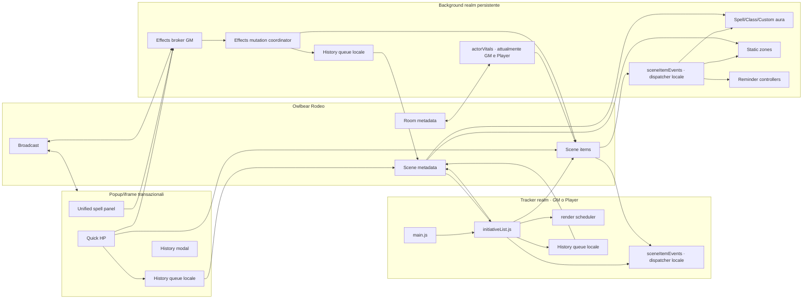
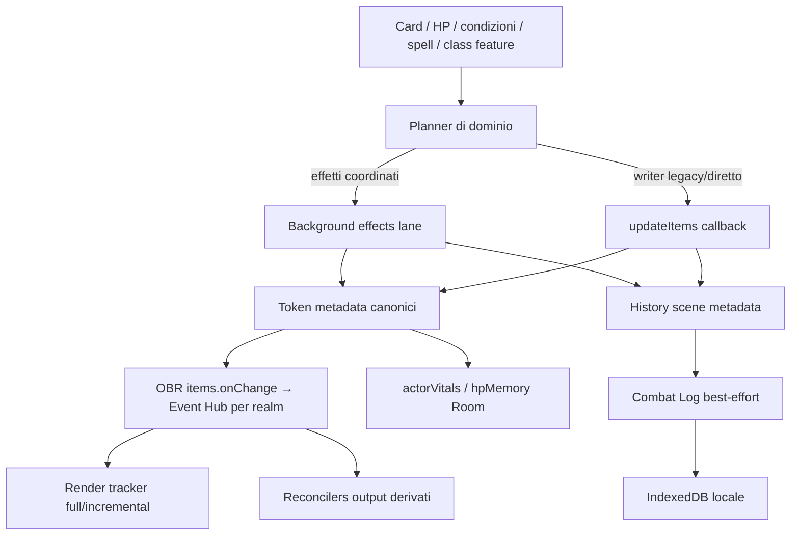
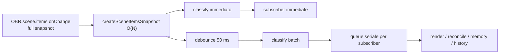

# General Stability & Performance Audit

## Identità dell'audit

| Campo | Valore |
| --- | --- |
| Progetto | Take Initiative! 1.3.0 |
| Branch | `main` |
| Commit analizzato | `be18c1e00914213b34d872a8a800ed5f77cdf954` |
| Data commit | 2026-08-13 11:34:22 +02:00 |
| Data audit | 2026-08-13 |
| Perimetro | Architettura, stabilità, concorrenza, lifecycle, metadata, History/Undo/Combat Log, rendering, reconcilers, performance, memoria e test |
| Modalità | Analisi read-only del codice; è stato creato soltanto questo rapporto |
| Valutazione finale | **BLOCKED BY P0** |

Le indicazioni di file e riga si riferiscono esclusivamente al commit sopra indicato. I documenti storici sono stati usati per ricostruire l'intento, ma ogni conclusione è stata verificata sull'implementazione corrente.

## 1. Executive summary

Take Initiative è un sistema ampio ma non privo di struttura. Le iniziative ARCH-002/003/004/005 hanno prodotto miglioramenti concreti: scritture metadata key-scoped, una lane seriale per gli effetti, Undo robusto per il dominio effetti, un Event Hub per realm, scheduling seriale del rendering e reconcilers idempotenti. La baseline automatica è interamente verde e le protezioni del tracker contro render stantii, perdita di focus e distruzione degli editor sono sostanziali.

L'audit ha però trovato tre percorsi P0 esterni o solo parzialmente inclusi in quelle protezioni:

1. `actorVitals` può usare uno snapshot Room come writer live e sovrascrivere HP canonici più recenti del token; il runtime è avviato anche nel background Player.
2. History serializza gli append solo dentro il singolo iframe. Due realm possono eseguire in parallelo lo stesso read-modify-write della chiave scene History e perdere una entry.
3. L'Undo non-effects non verifica che lo stato corrente corrisponda all'`after` registrato e applica delete/update/add in più passaggi senza atomicità. Può quindi cancellare modifiche successive o lasciare un ripristino parziale.

Questi problemi non richiedono una riscrittura. La soluzione minima comune è ridurre i writer autorevoli e far passare le mutazioni critiche attraverso un proprietario seriale per dominio, mantenendo gli attuali planner e formati persistenti.

### Distribuzione dei finding

| Priorità | Numero | Significato in questo audit |
| --- | ---: | --- |
| P0 | 3 | Perdita/corruzione di stato o Undo non sicuro |
| P1 | 4 | Stabilità o responsività ad alta probabilità nei critical path |
| P2 | 3 | Debito strutturale significativo o costo da misurare |
| P3 | 3 | Cleanup o costo minore |
| Totale | 13 |  |

### Cinque finding principali

| ID | Priorità | Sintesi |
| --- | --- | --- |
| GS-001 | P0 | `actorVitals` può ripristinare HP Room obsoleti sopra gli HP canonici live |
| GS-002 | P0 | append History concorrenti tra realm possono perdere entry |
| GS-003 | P0 | Undo legacy/non-effects non prevalidato e non atomico |
| GS-004 | P1 | scene epoch non pilotata nei popup transazionali |
| GS-005 | P1 | tre controller aura duplicano scansioni e richieste bounds seriali |

### Baseline eseguita

| Comando | Esito | Dettagli |
| --- | --- | --- |
| `npm.cmd test` | PASS | 1.464 test, 0 failure, 16,56 s |
| `npm.cmd run verify:version` | PASS | versione 1.3.0 coerente in package, lock e manifest |
| `npm.cmd run check:spells` | PASS | 319 spell catalogo, 477 full catalog, 358 trackable |
| `npm.cmd run build` | PASS | Vite 7.1.3, 409 moduli, 8,04 s |

La build avverte che almeno un chunk supera 500 kB (`classFeatureCatalog`, circa 904 kB minificati). È un segnale da profilare, non un finding di lentezza dimostrato: il warning non prova da solo un impatto sul critical path.

Gli script `audit:*` non sono stati eseguiti perché scrivono report JSON/Markdown versionati; avrebbero violato il vincolo di produrre soltanto questo deliverable.

## 2. Metodo e stato delle iniziative architetturali precedenti

Sono stati letti i documenti architetturali e gli audit correnti in `docs/`, inclusi:

- `ARCHITETTURA.md`, `ACTOR-HP-PERSISTENCE.md`, `docs/archive/historical/STABILIZZAZIONE_1_3.md`;
- `ARCH-002-METADATA-KEY-SCOPED.md`, `ARCH-003-EFFECTS-MUTATION-COORDINATOR.md`, `ARCH-004-EVENT-HUB-RENDER-SCHEDULER.md`, `ARCH-005-IDEMPOTENT-RECONCILERS.md`;
- `EFFETTI_LOCAL_ITEMS.md`, `MOVEMENT_MECHANICS.md`, `INCANTESIMI_E_ZONE.md`, `CAPACITA_CLASSE.md`;
- `OPTIONS-ARCHITECTURE.md`, `docs/archive/plans/OPTIONS-AUDIT.md`, `docs/archive/strategy/DESKTOP-PORT-AUDIT.md`;
- gli audit spell, Barbaro, capacità di classe, Embers, Unified Panel e tutti gli audit in `docs/class-features/audits/`.

La verifica sul codice corrente porta a questo stato effettivo:

| Iniziativa | Stato corrente | Limite ancora presente |
| --- | --- | --- |
| Scene epoch | Solida nel tracker e nel background effects | È un singleton per realm; diversi popup lo importano senza montare il lifecycle |
| Metadata key-scoped | Implementata per scene/room | Non risolve concorrenza sulla stessa chiave; resta last-commit-wins |
| Effects mutation coordination | Implementata e GM-gated nel background | Copre effetti e metadata patch esplicite, non tutti i writer produttivi |
| History/Undo effects | Command ID, retry e conflitto field-scoped presenti | Append History globale e Undo non-effects restano fuori dalla stessa garanzia |
| Event Hub | Un dispatcher condiviso per iframe/realm | Non è condiviso fra iframe e continua a fingerprintare snapshot completi |
| Render scheduler | Full/incremental seriali con revisioni e barriere | Un full render effettua una lettura item ridondante |
| Reconcilers | Ownership, epoch, retry e read-back presenti | I controller spaziali duplicano snapshot e cache |
| Stato canonico/derivato | Separazione generalmente corretta | `actorVitals` viola la direzione token canonico → memoria durante il runtime live |

Inventario statico utile a dimensionare il sistema:

- 31 entry HTML in `vite.config.js`;
- 184 file di test;
- 9.518 righe in `src/initiativeList.js`;
- 2.685 in `src/spellAreaRules.js`, 2.584 in `src/initiative-card-modal.js`, 2.409 in `src/effectsMutations.js`, 2.395 in `src/spell-unified-panel.js`;
- 166 occorrenze di `OBR.scene.items.getItems` in 50 file;
- 74 `updateItems` in 24 file, 18 `addItems` in 13 file, 30 `deleteItems` in 14 file;
- 36 `OBR.scene.getMetadata` in 24 file e 8 `OBR.room.getMetadata` in 4 file.

Questi numeri non sono di per sé finding. Servono a individuare le superfici dove una duplicazione di lavoro o un writer concorrente può moltiplicarsi.

## 3. Architettura corrente

### 3.1 Runtimes ed entry point

`public/manifest.json` monta `background.html` come runtime persistente e `action-launcher.html` come azione dell'estensione. `src/main.js` monta il tracker e il context menu. Vite costruisce inoltre popup separati per HP, History, spell, condizioni, scheda iniziativa, reminder, opzioni e strumenti.

Ogni pagina è un iframe/realm JavaScript distinto. Di conseguenza singleton, Promise queue, cache e `sceneEpoch.js` sono condivisi soltanto dai moduli caricati nella stessa pagina, non dall'intera estensione.

### 3.2 GM e Player

- Il tracker usa la stessa base di rendering per GM e Player, applicando proiezioni e policy di visibilità. I controlli di mutazione del turno sono GM-only.
- Il broker effetti nel background verifica il ruolo GM prima di montarsi (`src/effectsMutations.js:2027-2033`). Aura, zone e reminder mutanti sono anch'essi prevalentemente GM-gated.
- Pill e widget locali sono derivati per client; le attachment globali sono riconciliate dal writer proprietario.
- `bootstrapActorVitalsRuntime()` limita al GM la migrazione iniziale, ma chiama `startActorVitalsRuntime()` fuori dal gate (`src/background.js:86-122`). È l'eccezione critica descritta in GS-001.

### 3.3 Flussi principali di scrittura

## 4. Fonti di verità

| Dominio | Fonte canonica | Dati derivati/fallback | Writer legittimo atteso |
| --- | --- | --- | --- |
| HP creatura | `item.metadata[com.thebigpicture.initiative/meta].hp/hpMax` | barre/testo mappa; `actorVitals` e `hpMemory` come memoria | operazione HP sul token; memoria aggiornata dopo |
| Iniziativa/turno | scene `com.thebigpicture.initiative/state` | active label, ordine renderizzato, Turn Notice | tracker GM |
| Condizioni | token `meta.conditions` | pill/widget, reminder, modificatori velocità | effects coordinator |
| Spell | token `meta[.../spells]` e concentrazione | registro spell, aura/zone, pill, reminder | effects coordinator/executor |
| Class feature runtime | token `meta.classFeatureState` | pill, aura, reminder | runtime capacità, preferibilmente nella stessa mutation lane |
| Scheda personaggio | token `meta.initiativeCard`; registry Room per continuità | cache/local fallback | initiative card service |
| History | scene `com.thebigpicture.initiative/history`, max 30 entry | modal History | un unico append/Undo owner logico |
| Combat Log | eventi IndexedDB locali; scene conserva solo sessione attiva | export/testo UI | combat log service |
| Geometrie zona/aura | item scena tecnici con metadata owner/instance ID | membership/effects/visuali | reconciler proprietario |
| Preferenze | Room/scene/local secondo policy Options | proiezioni runtime | Options service |

La documentazione è coerente nel definire il token come fonte canonica degli HP. `actorVitals` deve quindi idratare un token nuovo o una nuova scena, poi seguire la direzione token → Room. Il comportamento live corrente è bidirezionale e crea un secondo writer autorevole.

## 5. Mappa dei writer

### 5.1 Token e item di scena

| Stato/item | Writer produttivi principali | Percorso | Valutazione |
| --- | --- | --- | --- |
| `meta.hp/hpMax` | Quick HP, tracker/card, class features, spell executor, Undo, `actorVitals`, hpMemory legacy | `updateItems` con merge del metadata | Troppi owner; GS-001 e GS-003 |
| condizioni/spell/concentrazione | `effectsMutations.js`; alcuni ingressi legacy sono convertiti in operazioni | broker → coordinator → planner → commit | Buono: seriale, epoch-aware, conflict-aware |
| `classFeatureState` | `classFeatureRuntime.js`, metadata patch effects, `classFeatureAuraController.js` | sia coordinator sia `withItemMetaHistory + updateItems` | Ownership divisa; GS-010 |
| boss metadata | `contextMenu.js`, tracker/card | callback `updateItems` | Merge top-level corretto; cleanup Paragon errato, GS-007 |
| movement/elevation | `speedCheck.js`, elevation context/tool | item position e metadata | Imperativo giustificato, con guard; cleanup cache incompleto |
| HP bars/text | `hpbar-items.js` | attachment owned, reconcile/batch | Derivato, non canonico; corretto |
| condition/spell widgets | `effectsReconciler.js`/layout | item locali owned | Derivato idempotente |
| aura/zone visuals | tre aura controller, static zone | add/update/delete solo item con metadata owner | Ownership buona; costo duplicato |

Non è stata trovata una sostituzione sistematica dell'intero metadata object canonico: i writer token esaminati preservano `item.metadata` e il contenuto della chiave plugin. La creazione di nuovi item derivati imposta invece, correttamente, metadata interamente posseduti dal relativo reconciler.

### 5.2 Scene metadata

| Chiave | Writer | Semantica |
| --- | --- | --- |
| `.../state` | soprattutto `initiativeList.js`; cleanup Paragon in `contextMenu.js` | read-modify-write dell'intero valore della chiave |
| `.../history` | ogni realm che importa `history.js` | append/filter/slice/write dell'intero array |
| `.../clocks` | `clocks.js` | read-modify-write key-scoped |
| `.../combat-log-state` | `combatLog.js` | puntatore alla sessione IndexedDB |
| Options/strumenti | store dedicati | key-scoped |

`metadataKeyScoped.js` protegge le altre chiavi top-level ma non effettua CAS, merge server-side o serializzazione globale. Il limite è esplicito in `ARCH-002-METADATA-KEY-SCOPED.md:63-66` e testato in `test/metadataKeyScoped.test.js:310-321`: sulla stessa chiave vince l'ultimo commit.

### 5.3 Room metadata

| Chiave | Writer | Note |
| --- | --- | --- |
| `.../actorVitals` | `actorVitalsStore.js` in ogni background | coda locale e merge revisionato, ma più client e reconcile token live |
| `.../hpMemory` | `hpMemory.js` | fallback legacy per token senza actorProfileId |
| `.../initiativeCards` | `initiativeCards.js` | registry card/quick actions |
| `.../factionRegistry` | `factionRegistry.js` | associazioni persistenti |
| Options | store options | merge e proiezioni dedicate |

Le code di scrittura Room sono anch'esse locali al realm. Revisioni e merge riducono i lost update, ma non attribuiscono autorità esclusiva a un client.

## 6. Async, lifecycle e concurrency

### 6.1 Aree solide

- `initiativeList.js:681-704` monta il lifecycle scene epoch, invalida appena la scena diventa unavailable e acquisisce una nuova baseline al ready.
- Il tracker resetta scheduler, timer, code di navigazione, cache di label, editor e snapshot quando riceve l'unload.
- `effectsMutations.js:2027-2163` mantiene scene identity, epoch, broker queue, dedup e code di retry; all'unload svuota richieste e retry.
- Il render scheduler usa una lane full prioritaria, incrementali compattati, revisioni e barriere. I controlli sono ripetuti dopo gli await e prima del commit DOM.
- I reconcilers ARCH-005 usano owner metadata, epoch, read-back/retry e cleanup mirato.
- Timer e cache dei controller aura/zone vengono cancellati su unmount e scene-unready.

### 6.2 Gap sistematico fra realm

`sceneEpoch.js` crea un singleton runtime-local con stato iniziale `epoch=0, ready=true` (`src/sceneEpoch.js:1-58`). Solo il tracker e il background effects chiamano `invalidateSceneEpoch`/`markSceneEpochReady`. Quick HP e Unified Panel leggono `currentSceneEpoch()` ma non montano `OBR.scene.onReadyChange`.

Ne consegue che, in quei popup, un controllo `isCurrentSceneEpoch(0)` resta vero anche dopo un cambio scena. Il problema non è la funzione di epoch, ma l'assenza del driver lifecycle in ogni entry point che la usa per autorizzare mutazioni.

### 6.3 Matrice delle protezioni

| Percorso | Epoch | Queue/revision | Cleanup | Esito |
| --- | --- | --- | --- | --- |
| Advance Turn | catturata e ricontrollata | navigation queue, desired revision, virtual ID handling | reset scena | Solido |
| Render tracker | prima/dopo await e pre-DOM | full/incremental scheduler | reset scena/editor | Solido |
| Effects mutation | epoch + scene identity background | serial queue, command ID, retry | clear unload | Solido |
| Aura/zone background | epoch a ogni reconcile | running/requested coalescing | timer/cache clear | Corretto, costoso |
| Quick HP | epoch catturata | History queue del popup | timer selezione su beforeunload | Epoch inefficace; GS-004 |
| Unified spell panel | epoch letta/passata | executor/broker | destroy UI | Epoch locale non pilotata; GS-004 |
| History append | epoch del realm | queue locale | reset locale | Non seriale tra realm; GS-002 |
| Undo non-effects | epoch del realm | action queue locale | n/a | Nessuna prevalidazione/atomicità; GS-003 |
| ActorVitals | epoch background | due code locali | stop/reset | Autorità live errata; GS-001 |

Token eliminati durante un effects command diventano conflitto/rejection nel piano coordinato. Nell'Undo non-effects, invece, un token mancante può produrre zero `existingIds`, ritornare `true` e far rimuovere la History entry senza avere ripristinato il token: è incluso in GS-003.

## 7. Event fanout

### 7.1 Flusso reale

`sceneItemEvents.js` crea un dispatcher per realm sopra l'unico listener SDK di quel realm. Sono presenti 23 call site produttivi di `subscribeSceneItemChanges` oltre al wrapper. I domini riducono il fanout, ma la classificazione di base resta globale perché Owlbear consegna uno snapshot completo.

### 7.2 Mappa sintetica evento → lavoro

| Evento/dominio | Subscriber principali | Read/mutazione/render | Frequenza potenziale |
| --- | --- | --- | --- |
| HP | tracker incremental, HP bars, actorVitals, hpMemory | card DOM, attachment batch, Room write | ogni modifica HP |
| Tracker structure | tracker full | scene state + due letture item | add/remove/nome/campi non-locali |
| Movement | speed check, aura, zone, History movement | geometria, bounds, eventuale warning/reconcile | ogni segmento/movimento SDK |
| Effects | pill reconciler, reminder, aura/zone | snapshot condiviso, metadata scene, effects lane | condizioni/spell/concentrazione |
| Aura | tre controller | tre scansioni, tre cache bounds, reconcile visual/effects | movement e cambi effetti rilevanti |
| Zone | static zone | scansione token×zone, trigger e watchdog | movement/effects + ogni 5 s con zone attive |
| Scene metadata | tracker, tre aura, zone, effect reminder | diversi reconcile globali | ogni write scene, inclusa History |
| Broadcast command | effects broker, notice host, popup | dedup command ID o layout/notice | per azione/reminder |

### 7.3 Fanout eccessivo osservato

- `classifyItemChange` imposta `hpMemoryAutofill` per qualunque `metaChanged` (`src/sceneItemChangeDispatcherCore.js:245-265`), non soltanto quando manca HP o cambia l'identità.
- `effectSaveReminderController` sottoscrive tutti gli item event senza dominio (`src/effectSaveReminderController.js:116-124`) e ricalcola i reminder sull'intero snapshot.
- Spell, class feature e custom aura ascoltano ogni `scene.onMetadataChange`, quindi anche History, clocks e opzioni possono provocare un reconcile spaziale.
- Static zone ascolta a sua volta ogni metadata scene e mantiene un watchdog di 5 secondi quando necessario.
- Il dispatcher costruisce fingerprint ricorsivi e classifica una volta per gli immediate e una seconda volta al flush. Il costo è plausibile ma non cronometrato: GS-008 è quindi **Needs measurement**.

## 8. Metadata safety

### 8.1 Aspetti corretti

- Le chiavi canoniche non sono state rinominate.
- Le scritture scene/room passano dagli adapter key-scoped; non sono state trovate chiamate produttive dirette a `scene.setMetadata`/`room.setMetadata` fuori dall'adapter.
- Gli update dei token preservano metadata estranei con spread dell'oggetto e della chiave plugin.
- I derived item sono selezionati per owner metadata/instance ID prima di update/delete.
- Il coordinator effetti prelegge, pianifica e applica metadata patch con aspettative field-scoped.

### 8.2 Rischi residui

| Rischio | Prova | Conseguenza |
| --- | --- | --- |
| Same-key RMW | ARCH-002 e test last-commit-wins | History e state possono perdere aggiornamenti fra writer |
| Stale Room → token | `actorVitalsStore.reconcileSceneItems` | HP canonici sovrascritti |
| Snapshot Paragon pre-toggle | `contextMenu.js:174-220` | cleanup deterministico errato |
| Writer `classFeatureState` divisi | direct History/update + coordinator patch | possibile conflitto cross-realm da validare |
| Undo legacy usa solo `before` | `history.js:828-904` | modifica successiva cancellata |

Le tombstone key-scoped sono esplicite e JSON-safe. Non è raccomandato introdurre un generico merge profondo dei metadata: i conflitti devono essere risolti a livello del dominio proprietario, non nascosti da un merge indiscriminato.

## 9. History, Undo e Combat Log

### 9.1 History

`withItemMetaHistory()` fotografa i campi prima e dopo l'azione, serializza snapshot/azione/snapshot tramite `__historyActionQueue` e appende al massimo 30 entry. Per una singola istanza modulo evita che due azioni catturino lo stesso stato iniziale.

Il limite è il confine del realm. Tracker, background, Quick HP e altri popup caricano istanze diverse di `history.js`; ciascuna ha le proprie `__historyWriteQueue` e `__historyActionQueue` (`src/history.js:29-30`). `appendEntryNow()` legge l'intero array, aggiunge l'entry e riscrive la chiave (`src/history.js:326-341`). Non esiste un owner unico cross-realm.

Per gli effects command la History entry usa l'ID deterministico `effects-history:<commandId>` e il background mantiene retry post-commit. Questo impedisce duplicati dello stesso comando ma non impedisce a un append non coordinato di sovrascrivere l'intero array letto da un altro realm.

### 9.2 Undo

L'Undo effects è il percorso migliore del progetto:

- prepara l'intero piano;
- verifica che tutti i campi posseduti coincidano con l'`after` registrato;
- restituisce conflict senza applicare una parte;
- committa nella stessa lane seriale;
- preserva campi estranei.

`restoreEntry()` devia su quel percorso solo se `entryTouchesEffects(entry)` è vero. Le altre entry eseguono in ordine:

1. letture per singolo scene item;
2. `deleteItems`;
3. nuova lettura;
4. `updateItems` dei campi `before`;
5. `addItems`.

Non confrontano mai lo stato live con `change.after`. `undoHistoryThroughNow()` ripete inoltre `restoreEntry` per più entry, poi sincronizza gli output e infine rimuove le entry History. Un errore al secondo step non annulla il primo.

### 9.3 Combat Log

History e Combat Log sono correttamente distinti:

- History è un journal scene condiviso e limitato a 30 entry, usato per Undo.
- Combat Log conserva in scene metadata soltanto l'identità della sessione attiva.
- Sessioni ed eventi vivono in IndexedDB locale (`src/combatLog.js:14-23,80-97`) e una transazione IndexedDB aggiorna sessione ed eventi.
- `recordHistoryInCombatLog()` è best-effort: un errore viene loggato e non cambia l'esito della mutazione canonica.

La semantica post-commit del coordinator effetti è corretta: dopo `commit`, errori di History o side effect producono `status: applied`, `committed: true`, `historyPending`/`postCommitErrors`, mai un falso fallimento non committato (`src/effectsMutationCoordinator.js:143-218`). I test coprono questo comportamento.

Il Combat Log non ha retention automatica: cresce finché l'utente non pulisce o elimina una sessione. È un debito P3 di storage locale, non corruzione dello stato condiviso.

## 10. Rendering tracker e Player view

### 10.1 Full e incremental

- Gli item event sono classificati in strutturali o locali.
- I cambi HP/condizioni compatibili usano dirty IDs e rendering incrementale.
- I cambi strutturali richiedono full render.
- Il full ha priorità e costituisce barriera per gli incrementali; gli ID dirty arrivati durante il full vengono ripresi dopo.
- Revisioni fonte e render impediscono a un risultato vecchio di fare commit.

`__executeFullRenderRequest()` controlla epoch e revision prima della lettura state, dopo le letture item e prima del DOM. Non è stata trovata una condizione in cui un full vecchio possa sovrascrivere un full più recente.

### 10.2 Editor, focus, scroll e layout

- `renderAll()` non bypassa il lock degli editor inline.
- Il dirty set conserva le card saltate mentre un editor è aperto.
- `renderTrack()` riconcilia per ID quando la struttura è compatibile e conserva lo snapshot di scroll.
- Le transizioni compatte misurano il layout in un punto controllato; non è emerso layout thrashing ripetuto nel percorso ordinario.
- I listener DOM vengono ricreati quando una card è realmente sostituita, non a ogni evento locale.

Le protezioni sono coperte da test del scheduler/core e da contract test. Manca comunque un test browser end-to-end con editor reale, Player view attiva e burst contemporaneo.

### 10.3 Lettura ridondante

Il full render esegue in parallelo:

- `getEntriesWithLair(stateRaw)` → `readEntries()` → `OBR.scene.items.getItems()` completo;
- `getSpellBoardTokenItems()` → un secondo `OBR.scene.items.getItems(filter)`.

I board token sono già presenti nel primo snapshot. È quindi una chiamata SDK e una scansione evitabili per ogni full render (GS-009). La correzione minima è estrarli dallo snapshot già letto, senza toccare scheduler o DOM.

## 11. Derived output e reconcilers

| Sistema | Canonical state | Planner/desiderato | Reconcile/ownership | Valutazione |
| --- | --- | --- | --- | --- |
| HP bars/text | token `hp/hpMax` | geometria/colore/testo | attachment HP owned, batch e cleanup | Solido |
| Active turn label | scene state + token attivo | label desiderata/revisione | pump seriale, retry e cleanup owner | Solido |
| Condition/spell pills | token conditions/spells/concentration | widget locali desiderati | local items per client, owner metadata | Solido |
| Spell aura | spell instance + source | visuale e membership | item owner + effects coordinator | Corretto, costo duplicato |
| Class feature aura | class state + instance | visuale, membership, suppression | item owner + effects; suppression diretta | Ownership da consolidare |
| Custom aura | `customAuras` token | visuale/membership | item owner + effects | Corretto, costo duplicato |
| Static zones | zone item + spell/caster/turno | membership, runtime trigger, output | coordinator, owner IDs, recovery/watchdog | Solido, O(Z×T) da misurare |
| Elevation label | token elevation | label desiderata | attachment owner e debounce | Solido |
| Movement warning | posizione + speed state | decisione consentito/bloccato | rollback e broadcast imperativi | Imperativo giustificato |
| Reminder visuali | effect/zone runtime + turno | notice aggregata | broadcast + dedup/cache | Solido, fanout ampio |

History, Combat Log e warning di movimento sono naturalmente event/journal oriented; convertirli in reconcilers non porterebbe un beneficio evidente. Le visualizzazioni persistenti e le membership, invece, sono già correttamente orientate a desired state e non vanno riportate a update imperativi ad hoc.

Non sono stati trovati delete globali indiscriminati delle attachment HP o degli output aura/zone. I cleanup usano metadata di ownership e riferimenti di istanza.

## 12. Performance e responsività

### 12.1 Hotspot dimostrati

| Hotspot | Costo staticamente dimostrato | Classe |
| --- | --- | --- |
| Tre aura controller | con 40 token e cache fredda: almeno 15 chiamate setup complessive e fino a 120 `getItemBounds([id])` seriali, anche senza aura attiva; letture output owned ulteriori | A, GS-005 |
| HP/card memory invalidation | per evento qualificato: 2 read immediate (items mirati + Room card registry) e 1-2 read debounced (Room HP memory + full scene se memoria non vuota) | A, GS-006 |
| Full tracker render | due letture scene item invece di una | A, GS-009 |
| Duplicate boot HP memory | due chiamate identiche; il busy guard evita il doppio lavoro ma resta una invocazione inutile | A, GS-012 |

Il calcolo aura deriva da tre implementazioni quasi parallele. Ogni controller esegue `scene.isReady`, full `getItems`, scene metadata, DPI e scale; costruisce `requiredIds` includendo tutte le creature; `sceneItemBoundsCache.load()` attende `loadFresh` dentro un loop sequenziale (`src/sceneItemBoundsCache.js:99-129`). Con 40 creature sono 40 round-trip seriali per controller, non 40 operazioni locali.

### 12.2 Hotspot plausibili da misurare

| Percorso | Modello di costo | Perché non è ancora un bug dimostrato |
| --- | --- | --- |
| Event Hub | O(N) snapshot/fingerprint; classificazione immediata + batch | nessun tempo p95/long task rilevato |
| Static zones | O(Z×T), in alcuni casi due membership pass; watchdog ogni 5 s = 12 pass/min | cache bounds e coalescing possono rendere il costo accettabile |
| Effect save reminder | piano sull'intero snapshot a ogni item/scene event | snapshot riusato e queue compattata; manca timing |
| Scene metadata fanout | History/clock/options possono svegliare aura e zone | debounce può assorbire raffiche; manca contatore per causa |
| `classFeatureCatalog` bundle | circa 904 kB minificati | manca misura di download, parse e pagina che lo carica nel critical path |
| Full DOM con 40 card | costo proporzionale a card/pill/avatar | full è già evitato per molti eventi; manca profilo browser |

Questi casi sono marcati **Needs measurement**. Non è raccomandato modificare loop o watchdog prima di avere contatori produttivi.

### 12.3 Critical path

| Critical path | Stato |
| --- | --- |
| Movimento token | dispatcher + speed + aura + zone; principale candidato a fanout/geometry profiling |
| Modifica HP | render incrementale buono; memory/card side reads e actorVitals sono i rischi |
| Condizione/spell resolution | coordinator seriale e post-commit robusti; fanout derivato da misurare |
| Advance Turn | queue/revision solide; carico reminder/tick/label da profilare insieme, non isolatamente |
| Zone/aura membership | hotspot SDK più chiaro: cache separate e bounds seriali |
| Render tracker/Player | scheduling solido; doppia lettura full e costo DOM da misurare |
| Scene switch | tracker/background puliscono bene; popup transazionali no |
| Add/remove token | full render e reconcilers attesi; actorVitals hydration richiede ownership corretta |
| Batch operation | effects/HP batching presenti; History cross-realm resta punto di perdita |

## 13. Memory e lifecycle leak

### 13.1 Cache correttamente limitate o pulite

- History è limitata a 30 entry e azzera snapshot/movement map al cambio scena.
- `announcedActivationIds` viene ridotto da 500 a 250 e pulito al scene-unready.
- Le cache bounds dei quattro controller spaziali vengono svuotate a scene switch/unmount.
- Il broker effetti svuota dedup, richieste, retry e recovered result al cambio scena; `recoveredPostCommitResults` è inoltre limitato.
- I popup principali rimuovono interval/listener su `beforeunload` o `destroy`.

### 13.2 Crescita residua

- `rejectedMovementRollbacks`, `rejectedElevationRollbacks` e `suppressedElevationResets` hanno TTL, ma vengono eliminati solo quando lo stesso token genera un evento futuro. Il reset scena pulisce `trackedDrags`, non queste tre mappe (GS-011).
- Combat Log conserva sessioni ed eventi IndexedDB senza cap temporale o numerico. Clear/delete sono manuali (GS-013).
- La persistenza IndexedDB non è memoria heap e non è cross-scene contamination; va comunque monitorata per sessioni lunghe e browser con quota ridotta.

Non è emerso un listener globale chiaramente duplicato all'interno dello stesso realm dopo mount/unmount. La moltiplicazione osservata deriva soprattutto dal fatto che più iframe hanno legittimamente listener propri.

## 14. Coupling e maintainability

La lunghezza di `initiativeList.js` non giustifica da sola una divisione. Il file contiene aree fragili che oggi funzionano grazie a stato condiviso e ordering esplicito. Le estrazioni utili sono solo quelle che riducono writer o chiamate SDK mantenendo i contratti attuali.

| Responsabilità estraibile | Dipendenze/contract proposto | Rischio | Beneficio | Vale la pena? |
| --- | --- | --- | --- | --- |
| Gateway per `initiative/state` | `applyInitiativeStatePatch({epoch, reason, patch/currentRevision})`; unico owner seriale | Medio | elimina RMW concorrenti e rende testabile Advance/Paragon | Sì |
| Provider snapshot full render | restituisce `{entries, boardTokens}` da un solo snapshot items | Basso | rimuove una call SDK e semplifica test call-count | Sì |
| Classificatore memory hydration | funzione pura decide quick-actions/HP fallback da before/after | Basso | restringe fanout senza toccare UI | Sì |
| Spatial snapshot service background | un solo snapshot items/grid/bounds versionato per aura e zone | Medio-alto | riduce 3 cache e round-trip duplicati | Sì, dopo harness |
| Intera `renderTrack` | DOM, editor, scroll, animazioni e role policy strettamente accoppiati | Alto | beneficio incerto | No |
| Navigation queue/turn transition | revisioni, virtual IDs, reminder e rollback già coesi | Alto | rischio regressione critico | Non ora |
| Spell tick/round paths | più percorsi intenzionali e molti contratti | Alto | nessun beneficio per questo audit | Non ora |

L'obiettivo non deve essere “moduli più piccoli”, ma meno owner per stato canonico e snapshot condivisi nei critical path.

## 15. Test audit

La suite è ampia e veloce: 1.464 test in 184 file. È particolarmente forte sui core puri di spell/class feature, geometria, scheduler, effects coordinator, Undo effects e reconcilers. Diversi contract test leggono il source e verificano pattern strutturali: utili contro regressioni accidentali, ma non sostituiscono esecuzioni multi-realm.

| Failure mode richiesto | Copertura corrente | Gap |
| --- | --- | --- |
| Scene switch durante await | Parziale: core epoch, tracker, effects | manca Quick HP/Unified Panel reale |
| Scene switch durante timer | Parziale: scheduler/notice/reconciler | manca inventario transazionale di tutti i popup |
| Scene switch durante transaction | Sì per effects; no per History legacy | test end-to-end multi-realm assente |
| Token delete durante workflow | Parziale per effects/zone | Undo non-effects può risultare applicato senza token |
| Source aura/zone eliminata | Buona copertura core/recovery | manca stress con eventi duplicati e più realm |
| SDK event duplicato | Dispatcher core compattato | manca sorgente SDK reale con background + tracker |
| Broadcast duplicato | Command/broker e alcuni notice | manca matrice completa popup/host |
| Command duplicato | Coperto per effects | non rilevante per writer legacy senza command ID |
| GM + Player | Proiezioni/policy unit test | nessun test concorrente di due runtime |
| Più iframe GM | Assente | essenziale per GS-002/GS-004 |
| Partial mutation failure | Coperto effects | assente per Undo delete/update/add |
| Undo conflict | Coperto effects | assente per HP/initiative/class legacy |
| Render race | Buona copertura scheduler/core | manca DOM browser reale con focus/scroll |
| Stale reconciliation | Buona copertura core/epoch | manca combinazione scene switch + controller multipli |
| Movement burst | Logica coperta | nessun test 100 eventi/call-count/p95 |
| 20-40 token | Assente come perf scenario | nessun budget SDK/render |
| Più zone sovrapposte | Regole core coperte | nessun profilo 10 zone × 40 token |
| Più effetti simultanei | Coordinator/core coperti | nessun fanout completo con Player view |
| Close/reopen popover | Parziale per warning transienti | assente per Quick HP/Unified transactional state |

### Test mancanti ad alto valore

1. Due istanze `actorVitalsStore` con Room/item event interlacciati, incluse una istanza Player e una modifica HP più recente del registry.
2. Due istanze isolate di `history.js` che leggono la stessa History e completano i write in ordine invertito.
3. Undo non-effects con `current != after`, token eliminato e failure in ciascuna fase delete/update/add; nessuna mutazione deve essere applicata prima della prevalidazione completa.
4. Quick HP e Unified Panel: switch A→B dopo ogni await significativo e chiusura/reapertura durante il commit.
5. Toggle Paragon off/on e Advance Turn concorrente sullo stesso scene state.
6. Scenario GM background + GM tracker + Player tracker con eventi SDK/broadcast duplicati.
7. Harness 40 token/10 zone/100 movimenti/100 HP/30 turni con call count e queue depth.
8. Browser test del tracker con editor dirty, scroll e Player view durante full+incremental interlacciati.

## 16. Performance harness proposto

Non va creato un benchmark che chiami soltanto funzioni geometriche pure. Il driver deve attraversare i controller e gli entry point produttivi.

### 16.1 Struttura minima

- Un test Node dedicato basato sull'attuale `node:test` e sul meccanismo di module mock già usato dalla suite.
- Un adapter OBR strumentato che conserva la semantica di snapshot/eventi e conta ogni metodo SDK, numero di item/ID e durata.
- Tre realm isolati: background GM, tracker GM e tracker Player. Per i casi popup, un quarto realm on-demand viene creato e distrutto.
- Si importano i moduli produttivi; il harness fornisce soltanto SDK, clock controllabile e fixture DOM già compatibile con i test esistenti.
- Un piccolo run browser/manuale complementare usa `PerformanceObserver` per `longtask` e misure DOM; non sostituisce lo scenario deterministico Node.

### 16.2 Fixture e sequenza

1. Caricare 40 token tracciati con HP, condizioni e profili realistici.
2. Creare 10 zone/aure, incluse sovrapposizioni, e 100 proiezioni condition/effect.
3. Stabilizzare baseline e azzerare i contatori.
4. Emettere 100 movimenti consecutivi attraverso `items.onChange` produttivo.
5. Eseguire 100 modifiche HP attraverso Quick HP/adapter reale.
6. Eseguire 30 Advance Turn attraverso il controller del tracker.
7. Fare scene unavailable/ready mentre code, debounce e un popup sono attivi.
8. Tenere Player view montata per l'intera sequenza.
9. Ripetere una volta a cache fredda e una a cache calda.

### 16.3 Metriche

| Metrica | Punto di raccolta |
| --- | --- |
| Chiamate SDK e item per call | proxy OBR per metodo/realm/causa |
| Full/incremental render | scheduler diagnostics e commit DOM |
| Reconcile pass | entry/exit di ogni controller con reason/correlation ID |
| Tempo handler | `performance.mark/measure`, p50/p95/max |
| Long task | `PerformanceObserver` nel run browser |
| Queue depth | render scheduler, effects coordinator, History owner, reconciler pump |
| Cache/memoria | size di bounds/dedup/map prima, dopo burst e dopo scene switch |
| Correttezza | HP finale, History count/ID, ordine/round, assenza output orfani |

Il primo run deve produrre una baseline, non soglie inventate. Solo dopo si fissano budget di regressione per scenario e realm. La misura più importante per GS-005 è il numero di round-trip bounds, non il solo tempo CPU del planner.

## 17. Findings

### GS-001 — P0 — ActorVitals può sovrascrivere HP canonici più recenti

- **File/funzione:** `src/background.js:86-122`, `bootstrapActorVitalsRuntime`; `src/actorVitalsStore.js:254-341`, `reconcileSceneItems`/`reconcileCurrentScene`; `src/actorVitalsStore.js:378-417`, `start`.
- **Call path:** background di qualunque ruolo → `startActorVitalsRuntime` → Room `onMetadataChange` → `reconcileCurrentScene` → full `getItems` → confronto registry → `updateItems` HP token.
- **Comportamento attuale:** se esiste un record Room valido, ogni token con lo stesso `actorProfileId` viene portato a `stored.hp/hpMax` quando differisce. Ogni Room change avvia il reconcile. Solo la migrazione è GM-gated; lo store live non lo è.
- **Perché è un problema:** il token è la fonte canonica dichiarata. Un registry di continuità diventa un secondo writer live e può vincere sopra una modifica più recente.
- **Prova/scenario:** token e registry sono a 5 HP. Il token passa a 3 HP. Prima che il relativo item event aggiorni il registry, un Room event contenente ancora 5 (anche per l'update di un altro attore) avvia il reconcile su un altro client; `getItems` vede 3 e `restoreById` scrive 5. Lo stesso può avvenire all'avvio del background Player.
- **Impatto:** perdita di danno/cura, divergenza GM/Player e oscillazioni fra token e Room.
- **Soluzione minima:** autorizzare Room → token solo durante hydration di nuova scena/token e baseline esplicita; dopo la baseline usare token → Room. Rendere ogni scrittura token GM-only. Il listener Room aggiorna la cache, non ripristina HP live.
- **File coinvolti:** `background.js`, `actorVitalsStore.js`, relativi core/test.
- **Rischio patch:** medio, perché va preservata la continuità cross-scena e la dedup dei token clonati.
- **Test necessario:** due store/client interlacciati, Player non writer, Room event non correlato, scene switch e duplicati actorProfileId.

### GS-002 — P0 — History perde append concorrenti tra iframe

- **File/funzione:** `src/history.js:29-30`, queue locali; `326-355`, `appendEntryNow`/`appendEntry`; call site in `initiativeList.js`, `quick-hp-modal.js`, `classFeatureAuraController.js`, `spellAreaResolutionExecutor.js`, effects background.
- **Call path:** due realm → rispettiva `withItemMetaHistory`/effects record → `scene.getMetadata` → append locale → `writeSceneMetadataKey(.../history)`.
- **Comportamento attuale:** la queue serializza solo dentro la singola istanza modulo. Entrambi i realm possono leggere lo stesso array H, costruire H+A e H+B e scriverli in ordine arbitrario.
- **Perché è un problema:** key-scoped non protegge la stessa chiave; l'ultimo commit elimina l'entry dell'altro writer. La mutazione canonica resta applicata ma non più annullabile.
- **Prova/scenario:** Quick HP registra A mentre il background registra B per un effects command. Entrambi leggono H; B scrive H+B, poi A scrive H+A. B scompare. ARCH-002 e il relativo test confermano la semantica last-commit-wins.
- **Impatto:** perdita di audit/Undo, possibile discrepanza con Combat Log e recovery post-commit che ritenta sopra una History già mutata.
- **Soluzione minima:** un unico History owner nel background, raggiunto via command/broadcast per append/remove/Undo. In alternativa un protocollo revisionato con reread/merge/retry, ma l'owner unico è più deterministico e riusa il broker pattern esistente.
- **File coinvolti:** `history.js`, `effectsMutations.js`/broker, entry point che registrano History, `history-modal.ts`.
- **Rischio patch:** medio-alto per compatibilità e comportamento offline del popup.
- **Test necessario:** due/tre realm isolati con write completati in ordine inverso, retry duplicato con stesso ID, retention a 30 entry.

### GS-003 — P0 — Undo non-effects non prevalidato e non atomico

- **File/funzione:** `src/history.js:828-904`, `restoreEntry`; `1022-1211`, `undoHistoryThroughNow`.
- **Call path:** History modal → Undo → per entry `restoreEntry` → delete → reread → update campi `before` → add → sync output → rimozione History.
- **Comportamento attuale:** solo le entry effects vanno a `undoEffectsMutation`. Le altre non confrontano lo stato live con `after`, non preparano l'intero batch e non hanno rollback transazionale.
- **Perché è un problema:** Undo può cancellare una modifica legittima successiva; un failure intermedio lascia una parte già ripristinata. Un token cancellato può non essere aggiornato ma l'operazione risulta riuscita.
- **Prova/scenario:** HP 10→5 produce History; un'altra azione porta HP a 3; Undo della prima entry imposta 10 senza conflict. In un batch, delete riesce e update fallisce: gli item eliminati restano eliminati e le entry History non descrivono più uniformemente lo stato.
- **Impatto:** corruzione HP/metadata/scene item e Undo parziale.
- **Soluzione minima:** generalizzare il piano field-scoped già usato dall'Undo effects. Prevalidare tutte le entry e tutti gli item del comando prima della prima write; se un campo posseduto non coincide con `after`, restituire conflict. Commit unico per gli update compatibili; add/delete devono avere un protocollo preparato e recovery esplicito.
- **File coinvolti:** `history.js`, `effectsMutationUndoCore.js` o un core generalizzato, broker History.
- **Rischio patch:** alto; è il cambiamento più sensibile dopo l'ownership History.
- **Test necessario:** conflict HP/class/position, token delete, failure delete/update/add, Undo-through multi-entry all-or-nothing, preservation di campi estranei.

### GS-004 — P1 — Scene epoch inattiva nei popup transazionali

- **File/funzione:** `src/sceneEpoch.js`; `src/quick-hp-modal.js:643-785`, `applyOperation`; `src/spell-unified-panel.js:1570-1593`; entry point `OBR.onReady` alle righe 885 e 2393.
- **Call path:** popup aperto in scena A → cattura `currentSceneEpoch()` locale → await SDK/History/effects → scena B → i check locali restano veri.
- **Comportamento attuale:** i popup importano il singleton epoch ma non montano `scene.onReadyChange`. Il valore resta 0/ready per tutta la vita dell'iframe.
- **Perché è un problema:** una mutazione può essere committata in A e perdere History/sync post-commit, oppure proseguire una fase con il background già sulla scene identity B. La guard dà una falsa garanzia.
- **Prova/scenario:** Quick HP committa `updateItems` in A; durante la cattura `after` avviene lo switch. Il popup non invalida l'epoch, legge B, non registra la modifica A e può continuare con effetti/memoria/UI stale.
- **Impatto:** operazioni parziali, History mancante, feedback riferito alla scena sbagliata; contaminazione diretta di B solo se gli ID target risultano validi anche lì.
- **Soluzione minima:** helper lifecycle condiviso montato in ogni entry point transazionale; invalidare/chiudere o disabilitare il popup a scene-unready e passare scene identity del background nei command.
- **File coinvolti:** `sceneEpoch.js` o nuovo helper piccolo, Quick HP, Unified Panel, altri popup che autorizzano write.
- **Rischio patch:** medio-basso se limitato al lifecycle e senza cambiare gli executor.
- **Test necessario:** switch dopo ogni await, close/reopen, commit già avvenuto seguito da failure post-commit, target eliminato.

### GS-005 — P1 — Cold start delle aure genera round-trip bounds seriali duplicati

- **File/funzione:** `spellAuraController.js:195-318`, `classFeatureAuraController.js:261-441`, `customAuraController.js:197-338`; `sceneItemBoundsCache.js:99-129`.
- **Call path:** mount/grid/metadata/item aura event → ciascun controller legge full scene/grid/state → include tutte le creature → cache propria → `getItemBounds([id])` sequenziale → reconcile.
- **Comportamento attuale:** tre controller quasi identici non condividono snapshot o bounds. Anche con zero aura, `requiredIds` include tutte le creature.
- **Perché è un problema:** latenza di rete/SDK seriale nel background e tre scansioni complete. Il debounce non elimina la duplicazione fra controller.
- **Prova/scenario:** 40 token, cache fredda, nessuna aura: fino a 3×40=120 richieste bounds seriali, oltre ad almeno 15 chiamate setup e alle letture degli output owned.
- **Impatto:** scene ready e grid change lenti; movimento meno responsivo quando le cache vengono invalidate.
- **Soluzione minima:** snapshot spaziale condiviso per generation; bulk `getItemBounds(ids)` se supportato; early exit che riconcili solo eventuali output orfani quando non esistono aura attive.
- **File coinvolti:** tre controller aura, `sceneItemBoundsCache.js`, eventuale servizio background.
- **Rischio patch:** medio, perché cleanup e source delete devono restare corretti.
- **Test necessario:** call-count 0/1/40 token, cache warm/cold, source delete, incomplete bounds/recovery, tre tipi aura simultanei.

### GS-006 — P1 — Invalidation HP memory troppo ampia amplifica ogni metadata change

- **File/funzione:** `sceneItemChangeDispatcherCore.js:245-265`; `initiativeList.js:9358-9374,9430-9437`; `initiativeCards.js:503-518`; `hpMemory.js:416-496`.
- **Call path:** qualsiasi plugin `metaChanged` → `hpMemoryAutofill` → immediate quick-action restore + debounce legacy HP autofill.
- **Comportamento attuale:** per token in iniziativa il restore quick actions legge items mirati e registry Room. Il fallback HP legge sempre la memoria Room e, se non vuota, l'intera scena.
- **Perché è un problema:** HP, condizioni, spell, class state e altri cambi metadata attivano letture di memorie che spesso non possono produrre alcun write.
- **Prova/scenario:** 100 HP changes distanziati oltre 150 ms producono fino a 400 read non direttamente necessari: due immediate per evento e due delayed; in una raffica il ramo delayed si compatta, quello immediate no.
- **Impatto:** latenza e traffico SDK/Room nel critical path HP.
- **Soluzione minima:** domini distinti: quick action hydration solo per add/identity/profile mancante; HP legacy solo per add/name/image/attitude o transizione reale a HP mancanti, escludendo actorProfileId.
- **File coinvolti:** dispatcher core, tracker subscriptions, card/hp memory.
- **Rischio patch:** basso-medio; il rischio è perdere una hydration legacy rara.
- **Test necessario:** matrice before/after per ogni campo, add token, metadata clear, actor-linked token, 100 HP changes con budget call-count.

### GS-007 — P1 — Toggle Paragon usa lo snapshot pre-toggle e può competere con Advance Turn

- **File/funzione:** `src/contextMenu.js:174-220`, `toggleParagonBossOn`; `src/initiativeList.js:3127-3140`, `setSceneState`.
- **Call path:** context menu → legge token → toggla `meta.paragon` → legge scene state → decide cleanup usando i token letti prima del toggle → riscrive l'intero state key.
- **Comportamento attuale:** in disattivazione `items` contiene ancora `paragon`, quindi `paragonInits[id]` non viene eliminato. Alla successiva attivazione lo snapshot pre-toggle è off e può eliminare lo stato stale. La write usa un `prev` completo e non la navigation queue.
- **Perché è un problema:** il cleanup è deterministicamente invertito. Se la rara write di cleanup si interlaccia con Advance Turn, può anche riscrivere `current/round/order` da uno snapshot precedente.
- **Prova/scenario:** attivare Paragon, popolare `paragonInits`, disattivare: il record resta. Riattivare mentre si avanza il turno: il cleanup può cancellare il record e, se ultimo commit, ripristinare l'indice precedente.
- **Impatto:** iniziative Paragon stale e turno non deterministico nel boss flow.
- **Soluzione minima:** derivare `stillOn` dall'intenzione del toggle o rileggere i token post-update; inviare soltanto una patch `paragonInits` al gateway seriale dello state.
- **File coinvolti:** `contextMenu.js`, gateway state in `initiativeList`/nuovo core.
- **Rischio patch:** medio per virtual IDs e ordine boss.
- **Test necessario:** on→off→on, più boss, stale map e concorrenza con next/previous.

### GS-008 — P2 — Event/metadata fanout globale

- **Stato:** **Needs measurement**, non bug dimostrato.
- **File/funzione:** `sceneItemChangeDispatcherCore.js:127-193,333-445,473-614`; aura controller `scene.onMetadataChange`; `effectSaveReminderController.js:116-124`; `spellStaticZone.js:1124-1127`.
- **Call path:** full snapshot OBR → fingerprint/classify → subscriber; qualunque scene metadata → più reconcile globali.
- **Comportamento attuale:** O(N) fingerprint e doppia classify; subscriber reminder item non filtrato; scene metadata non classificato per chiave.
- **Perché è un problema:** una singola mutazione effects può generare item event, History scene metadata event e più pass aura/zone/reminder.
- **Prova/scenario:** il call graph è dimostrato; tempo, coalescing effettivo e long task non sono misurati.
- **Impatto:** possibile degrado con 40 token, 10 zone e Player view.
- **Soluzione minima:** strumentare reason/correlation ID; filtrare digest delle chiavi scene; riusare lo snapshot hub; evitare il secondo piano quando lo stesso generation è già stato elaborato.
- **File coinvolti:** Event Hub, controller aura/zone/reminder.
- **Rischio patch:** medio; filtri troppo stretti possono perdere reconcile.
- **Test necessario:** harness fanout con contatori, eventi duplicati e mutation item+History.

### GS-009 — P2 — Full render legge due volte gli item della scena

- **File/funzione:** `initiativeList.js:8762-8811`, `__executeFullRenderRequest`; `4081-4103`, `readEntries/getEntriesWithLair`; `spellBoardToken.js:100-104`.
- **Call path:** full render → Promise.all → full `getItems` per entries + filtered `getItems` per board token.
- **Comportamento attuale:** i board token vengono riletti nonostante siano nello snapshot completo.
- **Perché è un problema:** una call SDK e una scansione per ogni full render, proprio nel path add/remove/scene switch.
- **Prova/scenario:** call path statico diretto; costo esatto 2 anziché 1 read item.
- **Impatto:** costo moderato, crescente con frequenza full e dimensione scena.
- **Soluzione minima:** far restituire a `readEntries` anche lo snapshot raw o derivare entrambi da un provider puro.
- **File coinvolti:** `initiativeList.js`, `spellBoardToken.js`/tracker core.
- **Rischio patch:** basso.
- **Test necessario:** un full = una call `getItems`, board token invariati, virtual IDs e scene revision stale.

### GS-010 — P2 — Ownership di `classFeatureState` divisa tra lane coordinate e writer diretti

- **Stato:** rischio architetturale; la perdita concorrente richiede validazione multi-client.
- **File/funzione:** writer diretti in `classFeatureRuntime.js` (per esempio `303-353`, `741-765`, `1469-1528`); patch coordinate `1142-1207,1298-1313`; `classFeatureAuraController.js:219-254`.
- **Call path:** UI risorsa/feature → `withItemMetaHistory + updateItems`; in parallelo effects/class feature activation → background metadata patch; aura cleanup → altro direct update.
- **Comportamento attuale:** lo stesso oggetto annidato può essere riscritto da callback e realm diversi. Alcuni path hanno `expected`, altri no.
- **Perché è un problema:** risorse, istanze e suppression condividono il medesimo campo; la coda History non è globale e non costituisce una mutation lane.
- **Prova/scenario:** adjustment risorsa e cleanup aura simultanei sullo stesso token. Le callback provano a leggere il draft corrente, ma non esiste un test che dimostri serializzazione cross-client dell'SDK.
- **Impatto:** possibile perdita di risorse/istanze e History incoerente.
- **Soluzione minima:** per le operazioni che cambiano `classFeatureState`, usare metadata patch expected field-scoped nel coordinator; mantenere planner e formato esistenti.
- **File coinvolti:** runtime/aura class feature, effects metadata patch, History.
- **Rischio patch:** medio-alto per ampiezza del catalogo; migrare per famiglie di operazioni.
- **Test necessario:** due realm, resource adjustment + activate/end/aura cleanup concorrenti, conflict senza partial write.

### GS-011 — P3 — Map di rollback movimento con TTL ma senza eviction globale

- **File/funzione:** `speedCheck.js:75-77,448-460,865-883,968-975,1103-1107`.
- **Call path:** rollback/suppression → `Map.set({until})` → delete solo al prossimo evento dello stesso token.
- **Comportamento attuale:** entry scadute restano se il token non genera più l'evento relativo; il scene reset pulisce `trackedDrags` ma non le tre mappe.
- **Perché è un problema:** piccola crescita heap durante sessioni lunghe e cambi scena.
- **Prova/scenario:** molti token diversi bloccati una volta, poi eliminati o mai più mossi.
- **Impatto:** basso; entry piccole, nessuna scrittura canonica.
- **Soluzione minima:** clear al scene-unload e prune opportunistico globale.
- **File coinvolti:** `speedCheck.js`.
- **Rischio patch:** basso.
- **Test necessario:** TTL, scene switch, nessun rollback valido cancellato prima dell'evento riflesso.

### GS-012 — P3 — Doppio bootstrap HP memory

- **File/funzione:** `initiativeList.js:3079-3096`.
- **Call path:** mount tracker → due IIFE consecutive → `applyHPMemoryToSceneForMissingHP()`.
- **Comportamento attuale:** due chiamate identiche; `__hpApplyBusyEpoch` evita normalmente il secondo lavoro.
- **Perché è un problema:** duplicazione e dipendenza implicita dal busy guard.
- **Prova/scenario:** due blocchi contigui equivalenti nel source.
- **Impatto:** minimo.
- **Soluzione minima:** rimuovere una sola IIFE, senza cambiare la funzione.
- **File coinvolti:** `initiativeList.js`.
- **Rischio patch:** molto basso.
- **Test necessario:** bootstrap applica il fallback una volta.

### GS-013 — P3 — Combat Log IndexedDB senza retention automatica

- **File/funzione:** `combatLog.js:201-270`, append; `408-425`, list; `437-528`, clear/delete manuali.
- **Call path:** eventi automatici/manuali → queue locale → transazione IndexedDB → nessun prune.
- **Comportamento attuale:** sessioni ed eventi persistono finché l'utente non li elimina.
- **Perché è un problema:** crescita storage in campagne lunghe; non è heap leak né perdita dati.
- **Prova/scenario:** molte sessioni e migliaia di eventi senza clear/delete.
- **Impatto:** basso, dipendente dalla quota browser.
- **Soluzione minima:** mostrare dimensione/numero eventi e offrire retention configurabile o prune esplicito di sessioni chiuse, mai silenzioso per default.
- **File coinvolti:** `combatLog.js`, History modal/options.
- **Rischio patch:** basso-medio perché il log è dato utente.
- **Test necessario:** retention opt-in, sessione attiva preservata, export prima del prune.

## 18. Interventi esplicitamente non raccomandati

- Non riscrivere il plugin o introdurre un nuovo framework di stato/UI.
- Non dividere `initiativeList.js` solo per ridurne la lunghezza.
- Non toccare le guard degli editor, le barriere full/incremental, la navigation queue o la gestione degli ID virtuali durante gli hardening non correlati.
- Non rendere `actorVitals`, HP bars, pill, aura visuali o Combat Log nuove fonti canoniche.
- Non fondere History e Combat Log: hanno retention, scope e finalità differenti.
- Non sostituire interi metadata object e non cambiare `com.thebigpicture.initiative/meta` o `.../state`.
- Non eliminare watchdog/retry dei reconcilers prima di avere il performance harness e una recovery equivalente.
- Non applicare un generico deep merge per nascondere conflitti same-key; serve ownership di dominio.
- Non ottimizzare loop puri o array recreation senza una misura produttiva.
- Non fare code splitting del catalogo soltanto per il warning Vite: prima misurare quale entry lo carica e il tempo parse reale.

## 19. Roadmap finale

Massimo otto interventi, ordinati per sicurezza, determinismo, responsività e semplificazione.

| # | Intervento | Scope | Dipendenze | Rischio | Test obbligatori | Beneficio previsto |
| ---: | --- | --- | --- | --- | --- | --- |
| 1 | Correggere autorità ActorVitals | hydration Room→token solo a baseline; live token→Room; GM-only token writes | Nessuna | Medio | due client/Player, interleaving, scene switch | elimina sovrascrittura HP P0 |
| 2 | Creare un unico History owner | broker per append/remove, ID idempotenti, retention centrale | Nessuna | Medio-alto | 2-3 realm, order inversion, retry | elimina lost append P0 |
| 3 | Generalizzare Undo field-scoped atomico | prevalidazione batch e commit/recovery per non-effects; includere gradualmente `classFeatureState` | #2 | Alto | conflict, token delete, failure per fase, Undo-through | elimina Undo P0 e riduce writer |
| 4 | Montare lifecycle scene nei popup mutanti | helper piccolo, scene identity, abort/close su unload | Indipendente; coordinare con #2/#3 per History | Medio-basso | switch dopo ogni await, close/reopen | elimina operazioni stale/partial P1 |
| 5 | Serializzare le patch initiative state e correggere Paragon | gateway unico per `.../state`; cleanup post-toggle/intention-based | Nessuna | Medio | boss virtual IDs + Advance concorrente | determinismo del turno e boss |
| 6 | Introdurre il performance harness produttivo | 40 token, 10 zone/aura, 100 move/HP, 30 turni, Player | Nessuna | Basso | ripetibilità e correctness assertions | baseline oggettiva e budget |
| 7 | Condividere snapshot/bounds spaziali | un generation snapshot per spell/class/custom aura, bulk bounds, early exit sicuro | #6 | Medio | cache cold/warm, source delete, recovery | forte riduzione SDK/scene-ready latency |
| 8 | Restringere fanout e riusare snapshot | domini memory precisi, metadata-key digest, board token dal full snapshot, dedup generation | #6; può seguire #7 per spatial fanout | Medio | call-count, hydration legacy, event duplicati | meno read/render/reconcile inutili |

### Sequenza e parallelismo

- Sequenziale obbligatoria: **#2 → #3**.
- Misura prima di ottimizzare: **#6 → #7** e **#6 → #8**.
- #7 e #8 possono procedere in parallelo dopo la baseline, coordinando il formato dello snapshot spaziale.
- #1, #2, #4 e #5 sono indipendenti e possono essere sviluppati su patch separate e reviewabili.
- I cleanup P3 (GS-011/012/013) non devono ritardare i P0/P1 e possono essere accorpati a manutenzione successiva.

## Valutazione finale

**BLOCKED BY P0**

## Addendum — stato dopo gli step 1-8 e release readiness

Il blocco P0 sopra e' la fotografia storica dell'audit sul commit indicato,
non il verdetto dello stato corrente del worktree. Gli step 1-8 sono stati
implementati e verificati con suite Node/fake-OBR, harness riproducibile e
controlli di build. Il blocker aggiuntivo dell'Undo lifecycle e' stato corretto:
una notifica duplicata `ready=true` non e' piu' interpretata come unload.

La traceability corretta e':

- **GS-005** e' il finding spaziale chiuso dallo Step 7; non va rinominato GS-007.
- **GS-007** e' il finding Paragon/state chiuso dallo Step 5.
- **GS-010** e' un rischio architetturale **P2 ancora aperto**, non P3 e non
  risolto: writer diretti e coordinatori concorrenti su `classFeatureState`
  richiedono ancora una validazione multi-client o un owner di dominio unico.

Lo stato di release storico e' documentato in
`docs/archive/releases/ROADMAP-CLOSURE.md`:
**GO condizionato** al checklist manuale browser/Owlbear per il contratto
single-GM; **NO-GO** se il requisito e' multi-GM con serializzazione globale,
perche' l'History Owner attuale garantisce ownership per client e last-commit-wins
tra client distinti, non un lock distribuito.

La baseline verde e i sottosistemi coordinati dimostrano che il plugin è funzionalmente maturo. Tuttavia, HP canonici, journal Undo e Undo non-effects hanno ancora percorsi in cui una concorrenza realistica o un conflitto successivo può perdere dati. La release dovrebbe essere considerata bloccata finché GS-001, GS-002 e GS-003 non sono corretti e coperti da test multi-realm/partial-failure. Gli interventi successivi possono essere incrementali e non richiedono una riscrittura dell'architettura.
